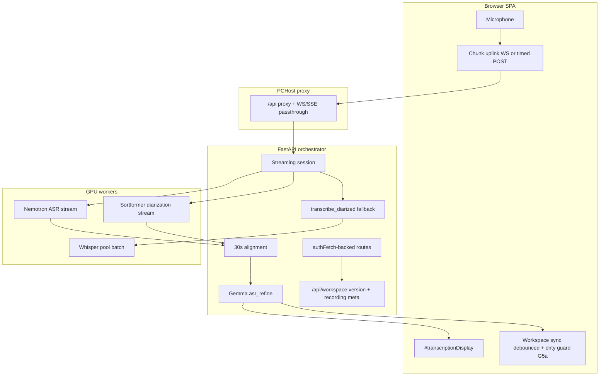
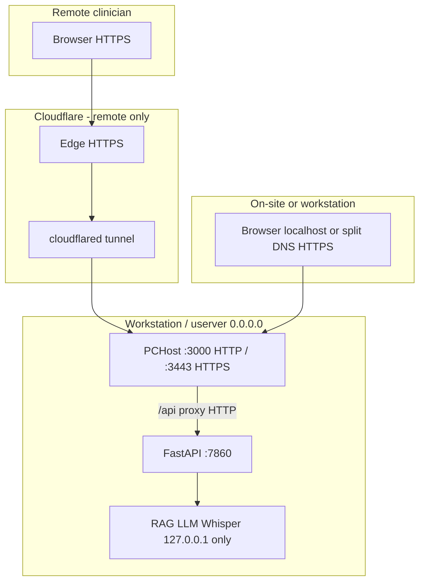
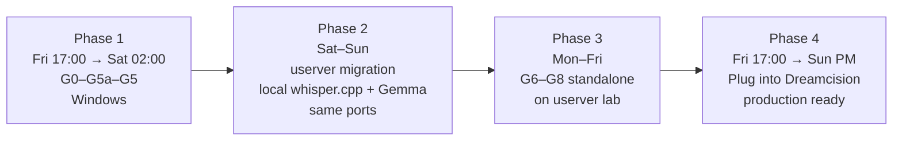

# Grand Plan — Connectivity, Networking, ASR Resilience & Streaming Diarization

Unified phased roadmap for the DreamCision clinical workspace (PCHost → FastAPI → GPU workers). Merges **sync hardening**, **two-plane networking** (browser HTTPS vs server-local HTTP), **ASR resilience**, and **streaming diarization** into one sequenced program with explicit dependencies, rollback, and acceptance criteria.

**Related documents (do not duplicate — cross-link and keep in sync):**

| Document | Scope |
|----------|--------|
| [`Clinical-Note-Generator/docs/ASR_PIPELINE_RESILIENCE_PLAN.md`](../Clinical-Note-Generator/docs/ASR_PIPELINE_RESILIENCE_PLAN.md) | ASR failure modes A–E (detail) |
| [`Clinical-Note-Generator/docs/ASR_PIPELINE_MAP.md`](../Clinical-Note-Generator/docs/ASR_PIPELINE_MAP.md) | Current batch pipeline map |
| [`docs/DEPLOYMENT_PATHS.md`](DEPLOYMENT_PATHS.md) | Repo vs live symlink paths |
| [`docs/OPERATOR_RUNBOOK_WINDOWS.md`](OPERATOR_RUNBOOK_WINDOWS.md) | NSSM / service operations |
| [`Clinical-Note-Generator/docs/ENV_VARIABLES.md`](../Clinical-Note-Generator/docs/ENV_VARIABLES.md) | Env toggles |

**Phase naming:** prefixed to avoid collision.

| Prefix | Meaning |
|--------|---------|
| **G*n*** | Grand-plan milestone (rollup) |
| **Sync-P*n*** | Connectivity & workspace sync |
| **Sync-AO*n*** | Anti-overwrite local draft protection (subset of Sync-P*) |
| **Net-P*n*** | Browser HTTPS vs server-local HTTP; Cloudflare tunnel; split DNS; edge cache |
| **ASR-P*n*** | ASR pipeline resilience |
| **Stream-P*n*** | Live streaming diarization (Nemotron + Sortformer + Gemma) |

---

## Status & execution truth (READ FIRST)

This section exists because "is it ready?" was repeatedly answered ambiguously. **Every milestone has three independent states. Never collapse them into one word like "done" or "ready."**

### Status legend (use these exact labels everywhere)

| State | Meaning | How to verify |
|-------|---------|---------------|
| **CODE** | Source written + unit/pytest pass **in the repo** (`C:\project-root`). | `pytest` green; file present. |
| **DEPLOYED** | The **running** service/process is executing that code. | Probe the live endpoint / restart confirmed. Code in repo ≠ deployed. |
| **VERIFIED** | Deploy window executed + smoke tests passed + operator sign-off logged. | Smoke checklist ticked; commit hash + flag state recorded. |

A milestone is only truly complete at **VERIFIED**. PCHost serves frontend JS straight from the repo, so **web changes are DEPLOYED as soon as the file is saved**; **backend (FastAPI) changes are NOT DEPLOYED until FastAPI restarts**.

### Definition of done (per milestone)

1. CODE: implemented + pytest pass.
2. DEPLOYED: service restarted; live probe shows new behavior.
3. VERIFIED: smoke tests for that milestone pass; flag state + commit hash logged in `IMPLEMENTATION_LOG.md`.

### Current reality snapshot — 2026-06-12 (Fri evening), measured

Phase 1 deploy window **executed** (operator ran elevated `Restart-Service OfficeStack -Force`); full smoke pass green. See [`IMPLEMENTATION_LOG.md`](./IMPLEMENTATION_LOG.md) 2026-06-12 (evening) entry for flag state + evidence.

| Milestone | CODE | DEPLOYED | VERIFIED | Evidence |
|-----------|------|----------|----------|----------|
| G0 flags + telemetry | ✅ | ✅ | ✅ | `feature_flags.py` live; pytest green |
| G1 unload + apiBase | ✅ | ✅ | ✅ | unload save smoke pass |
| G1′ recording reconcile | ✅ | ✅ | ✅ | record→transcript attaches to encounter (smoke) |
| G2 SQLite WAL | ✅ | ✅ | ✅ | live DB `journal_mode=wal`, `busy_timeout=5000` |
| G3 authFetch + apiFetch fix | ✅ | ✅ | ✅ | single `window.apiFetch`; generate works in-app |
| G4 pipeline refresh | ✅ | ✅ | ✅ | long generation, no 401 mid-gen (smoke) |
| G5a anti-stomp (AO-F1–F4) + local-draft recovery | ✅ | ✅ | ✅ | reload-persist, cross-tab, **abrupt-close recovery** all pass |
| G5 version GET / proxy / cache | ✅ | ✅ | ✅ | `GET /api/workspace/version` → **401** live (was 404); rename bumps version |
| G6–G8 streaming | ❌ | — | — | Phase 3+ |
| Net-P0 baseline | ✅ | ✅ | ✅ | TTFB table logged (2026-06-12 eve) |
| Net-P1 tunnel HTTP origin | ✅ | ✅ | ✅ | `notes`/`app` origin → `http://127.0.0.1:3000`; remote TTFB 224→**186 ms**; `/`→200, `/api`→401 |
| Net-P2/P5/P6 | ❌ ops | — | — | Phase 2 (split DNS, dashboard, runbooks) |
| Net-P3 cache headers | ✅ | ✅ | ✅ | path-based `Cache-Control` in `PCHost/server.js` |

**Bottom line as of 2026-06-12 evening:** Phase 1 is **DEPLOYED + VERIFIED + committed (`fb4f135`)**. One deploy-time regression was caught and fixed (the `generate_v8_stream` 307→https self-redirect, see **R6**), and a G5a durability gap (abrupt-close edit loss) was hardened with a localStorage draft mirror (`SYNC_LOCAL_DRAFT`). Next: **Phase 1b (Net-P1)**, then **Phase 2 (userver)**.

### Rule for any assistant updating this plan

- State milestone status as `CODE / DEPLOYED / VERIFIED` — never a bare "done".
- A passing unauthenticated probe (401/404 via curl) is **not** a clinical-flow test. Use the in-app path or an authenticated smoke.
- Do not write "production ready" until the **VERIFIED** column is ticked and logged.

---

## Executive summary

| Track | Problem | Outcome |
|-------|---------|---------|
| **Sync** | Broken unload save, stale API base, inconsistent auth on `fetch`, SQLite locks, dishonest “Connected”, **server pull/409 stomping local typed text** | Reliable auth, saves, multi-user DB stability, **local DOM authoritative until PUT succeeds** |
| **Network** | Remote users pay ~180 ms tunnel RTT on every request; on-site staff use tunnel unnecessarily; global `no-store` blocks edge cache; mic requires secure context | **Two planes:** HTTPS only for browser entry; **HTTP on 127.0.0.1** for all backends; tunnel for remote only; split DNS for on-site |
| **ASR resilience** | Stale recording ids, token expiry during record→stop, 401 not durable | No silent audio loss; server is source of truth for recordings |
| **Streaming diarization** | Batch-only Whisper on stop; no live speaker labels | Live mic → dual workers → 30s Gemma refine → stream to UI; Whisper batch as fallback until parity |

**Linchpin:** **Sync-P2 (`authFetch`)** — unified token + refresh-aware fetch. ASR-P1 and all streaming work build on it. Do not parallelize client fetch migrations with other tracks.

**Current production path (unchanged until Stream-P1 parity gate):** one WebM on stop → `POST /api/transcribe_diarized` (Whisper pool) → `#transcriptionDisplay`; `asr_recording` for Re-transcribe.

**Target streaming path (additive):** mic tee → server orchestrator → Nemotron ASR stream + Sortformer diarization stream → 30s alignment → Gemma (`asr_refine`) → SSE to display; full audio still persisted for stop/fallback/Re-transcribe.

**Clinical ASR policy (non-negotiable for streaming + batch re-transcribe):**

| Policy | Setting |
|--------|---------|
| **VAD** | **Off** on streaming path (Nemotron, Sortformer, and any upstream gate). No silence-based frame dropping. |
| **Sensitivity** | **Maximum** — prefer picking up quiet/distant speech (including noise that may be speech) over missing real speech. Tune `no_speech` / energy gates toward **false positives**, not false negatives. |
| **Quality** | **Highest** tier models and decode settings for live and re-transcribe; accept higher GPU cost and latency. |
| **Full-audio re-transcribe** | User must be able to **re-run transcription on the entire persisted recording** (merged encounter audio) and **commit the result** to `#transcriptionDisplay` + workspace — not preview-only. |

Today’s batch Whisper path already defaults **`vad_default: false`** in admin config and does not enable `ASR_WHISPERCPP_VAD` unless set. Streaming workers must follow the same policy explicitly.

**Networking constraint (drives Net-P*):** Browsers require a **secure context** for mic/camera. Use **HTTPS via Cloudflare** for remote clinicians; use **`http://localhost:3000`** on the workstation (fastest); use **split-horizon DNS** so on-site staff open the same `https://notes.ieissa.com` bookmark but resolve to LAN IP (no tunnel). **Never** expose FastAPI/RAG/LLM/Whisper on LAN — they stay **`http://127.0.0.1`** behind PCHost’s `/api` proxy only.

---

## Overnight execution — what is and is not realistic

**Short answer:** An **overnight maintenance window** can deploy **pre-built, pre-tested code** for **Sync G0–G5 + ASR-P0/P1** if implementation is finished **before** the window. The **full program including streaming (G6–G7)** cannot be completed in one night — Nemotron/Sortformer/Gemma integration is **weeks** of GPU wiring even after foundations ship.

### Feasible in one overnight window (~8–12 h, code ready)

| Milestone | Deploy overnight? | Notes |
|-----------|-----------------|-------|
| G0 | Yes | Flags + telemetry |
| G1 + G1′ | Yes | Web-only |
| G2 | Yes | FastAPI restart for WAL (~30s) |
| G3 | Yes | authFetch — **highest risk**; soak next clinical day |
| G4 + G5a + G5 + Net-P1 | Yes | Net-P1 config-only; G5a web; PCHost restart once for G5 |
| G8 (partial) | Yes | SW bump, docs |

**Prerequisites:** all code merged and pytest/smoke passed **before** window; rollback flags tested; DB backup taken.

### Not feasible in one overnight window

| Milestone | Why |
|-----------|-----|
| **G6 Stream-P0** | New WS routes, worker stubs, client draft/committed model — days minimum |
| **G7 Stream-P1** | Nemotron + Sortformer live + 30s Gemma + sensitivity profile + parity — **2–4+ weeks** |
| **Writing + testing G0–G5 from scratch overnight** | ~2–3 engineer-weeks of work compressed unsafely |

### Recommended overnight schedule (aggressive)

If you want **maximum sync/resilience in one night** (Friday eve → Saturday AM):

```
22:00  Pre-flight, backup DB, set flag state per policy (safety ON, STREAMING_ASR_ENABLED=0), deploy all G0–G5 artifacts
23:00  Enable G1 + G1′ → smoke T1–T4
00:00  G2 WAL → FastAPI restart → smoke T5
01:00  G3 authFetch → smoke T7–T8 (extended soak optional until AM)
02:00  G5a anti-overwrite sync → smoke T19–T22 (AO-F1–F4 must pass)
03:00  G4 ASR-P1 → smoke T6, T9
04:00  G5 proxy + version → PCHost restart → smoke T10–T11, T14
05:00  Net-P0 baseline curls; Net-P1 cloudflared HTTP origin → T23–T24
06:00  G8 SW bump; leave STREAMING_ASR_ENABLED=0
07:00  Sign-off or rollback per milestone
```

**Streaming (G6–G7)** follows in **separate overnights** after workers exist — not the same window as G0–G5 unless G6 is scaffold-only (stubs, no Nemotron).

---

## Architecture (target state)



### Networking planes (target state)

Two models — not one:

| Plane | Who | Protocol | Cloudflare? | Why |
|-------|-----|----------|-------------|-----|
| **Browser → PCHost** | Humans (mic/camera) | HTTPS remote or `localhost` HTTP/HTTPS on machine | **Yes, remote only** | `getUserMedia` requires secure context |
| **PCHost/FastAPI → backends** | Server processes | **HTTP `127.0.0.1`** | **Never** | No browser; already local |

**Measured baseline (workstation, 2026-06):**

| Path | `/api/version` TTFB |
|------|---------------------|
| `http://127.0.0.1:7860` (direct FastAPI) | ~2 ms |
| `https://127.0.0.1:3443` (local PCHost HTTPS) | ~6 ms |
| `https://notes.ieissa.com` (tunnel + edge) | ~170–210 ms |

The ~180 ms is **tunnel + Cloudflare round-trip**, not a slow API. **Good news:** stack is already shaped correctly — PCHost proxies `/api` → `http://127.0.0.1:7860`; UI defaults to relative `/api` (same-origin). Slowness is remote tunnel on every request + no edge cache for static assets.



**Secure-context rules (non-negotiable):**

| URL clinician opens | Secure context? | Mic/camera? |
|---------------------|-----------------|-------------|
| `https://notes.ieissa.com` | Yes | Yes — remote (tunnel) |
| `http://localhost:3000` / `http://127.0.0.1:3000` | Yes (browser exception) | Yes — workstation, fastest |
| `https://notes.ieissa.com` via internal DNS → LAN IP | Yes (cert matches hostname) | Yes — on-site, no tunnel |
| `http://192.168.x.x:3000` | **No** | **Blocked** — do not use for recording |

**Do not:** point `AuthWorkspace.apiBase` at `http://127.0.0.1:7860` from an HTTPS page (mixed content); tunnel FastAPI/RAG/LLM/Whisper separately; remove tunnel for remote users.

Detail: **[Networking track (Net-P0–P6)](#networking--fast-local-access--https-tunnel-only-where-required)** below.

---

## Master calendar (agreed execution order)

Four phases. **Dreamcision production** stays on **batch Whisper** until **Phase 4** sign-off Sunday afternoon.



| Phase | When | Where | Scope | Production impact |
|-------|------|-------|-------|-------------------|
| **1** | **Fri 17:00 → Sat ~02:00** | **Windows** (current host) | **G0–G5a–G5** sync, auth, anti-overwrite, resilience, proxy; **Net-P0** baseline | Deploy hardened Dreamcision on Windows |
| **1b** | **Sat ~02:00–04:00** | **Windows** | **Net-P1** tunnel HTTP origin (config); smoke **T23–T24** | Remote TTFB improvement; no app code |
| **2** | **Sat–Sun** (same weekend) | **userver** | Migrate PCHost, FastAPI, RAG, SQLite, systemd; **whisper.cpp + Gemma on 127.0.0.1** (same ports); **Net-P2–P6** split DNS, cache headers, runbooks | Cutover; on-site bypasses tunnel; batch ASR + LLM local on userver |
| **3** | **Mon–Fri** (following week) | **userver lab** | **G6–G8 build + test** as **standalone streaming module** — **not wired into Dreamcision UI** | None on clinical app |
| **4** | **Fri 17:00 → Sun ~15:00** (next weekend) | **userver** | **G6–G7 integrate** into Dreamcision + colocated GPU; **G8**; full test/debug; **production ready** | Streaming ASR go-live (flag-gated) |

**Prerequisite:** G0–G5 **and G5a (AO-F1–F4)** at **CODE** state (merged + pytest-green) before the Phase 1 window. As of **2026-06-12** this prerequisite is **met** — see [Status & execution truth](#status--execution-truth-read-first). The calendar below is the **target deploy procedure**; the window itself (restarts + smoke + sign-off) has **not** been run.

---

### Phase 1 — G0–G5a–G5 on Windows (Fri 17:00 → Sat ~02:00)

| Time (local) | Milestone | Action |
|--------------|-----------|--------|
| Fri 16:00 | Pre-flight | DB backup, flag state per [policy](#feature-flag-policy-authoritative--supersedes-any-all-flags-off-wording-below) (safety ON, `STREAMING_ASR_ENABLED=0`), commit hash, `CACHE_NAME` ready |
| Fri 17:00 | Deploy | Artifacts for G0–G5a–G5 |
| Fri 17:30 | **G0** | Telemetry baseline |
| Fri 18:00 | **G1 + G1′** | Smoke **T1–T4** → enable flags |
| Fri 19:00 | **G2** | WAL → **FastAPI restart** → **T5** |
| Fri 20:00 | **G3** | authFetch → **T7–T8** (overnight soak OK) |
| Fri 21:00 | **G5a** | Anti-overwrite sync (Sync-AO) → **T19–T22** |
| Fri 22:00 | **G4** | ASR-P1 → **T6, T9** |
| Sat 00:00 | **G5** | Version, proxy → **PCHost restart** → **T10–T11, T14** |
| Sat 02:00 | Sign-off | G0–G5a–G5 complete or rollback per milestone |
| Sat 02:30 | **Net-P0** | Record latency baseline per path; document canonical URLs |
| Sat 03:00 | **Net-P1** | cloudflared → `http://127.0.0.1:3000` origin → **T23–T24** |

**Rollback:** flags OFF; Windows stack unchanged for Phase 2 migration source.

---

### Implementation status

**Single source of truth for status is the [Current reality snapshot](#current-reality-snapshot--2026-06-12-fri-measured) at the top of this document.** Do not maintain a second status table here (that is what previously drifted). In one line:

> **Phase 1 = DEPLOYED + VERIFIED (2026-06-12 evening).** Full smoke pass green after a deploy-time proxy fix (R6) and a G5a abrupt-close durability hardening. Working-tree changes still need committing. Streaming (G6–G8) and most Net-P* are not started.

---

### Phase 2 — userver migration (Sat–Sun, same weekend)

> **📋 Detailed execution runbook: [`docs/PHASE2_USERVER_RUNBOOK.md`](PHASE2_USERVER_RUNBOOK.md)** — step-by-step, copy-paste commands + systemd unit files for a lighter execution model. The table below is the high-level plan; the runbook is canonical for execution.
>
> **userver read-only audit (2026-06-12) — key facts that change Phase 2:**
> - **Much of the AI stack is already running there as systemd:** Gemma `gemma4-26b-awq` on **`:8081`** (`vllm-26b-card1.service`) and Qwen `qwen3.6-27b-awq` on **`:8000`** (`vllm-27b-card0.service`). **whisper.cpp is already built + running** (`~/whisper.cpp`, med-finetuned model, on `:8097`, but as a fragile login-shell process). → Phase 2 **reuses** these; it does **not** rebuild/redeploy LLMs.
> - **Runtime decision = native systemd, NOT Docker.** The running stack is already systemd on `127.0.0.1`; Docker adds loopback friction for no GPU/latency benefit. The Docker-based `~/DreamCision/migration_plan_final_v4.md` on userver (full wipe + hot-standby failover + Thunderbolt program) is **superseded** for this scope and parked as a separate future decision.
> - **Fallback LLM port reconciliation:** Windows used `8037`; userver's fallback Qwen is on **`8000`**. → set `LLM_*_FALLBACK` to `http://127.0.0.1:8000` (no new 8037 listener).
> - **Must install on userver:** Node.js (missing), python `pip`/venv tooling. cloudflared 2026.5.2 already installed (unconfigured); git/cmake/gcc/ffmpeg/jq present; passwordless sudo available; 3.3 TB free; ports 3000/3443/7860/8007/8095/8096 free.

Move **Dreamcision app stack** to userver and **reuse the already-running local AI listeners**. **Same port layout as today** (except fallback → 8000), all on **`127.0.0.1` on userver** — not remote to Windows. **Do not** enable Nemotron/streaming until Phase 4.

| Step | Task |
|------|------|
| 1 | Clone repo on userver; Linux venv (FastAPI, RAG); Node (PCHost) |
| 2 | **systemd** units: `dreamcision-pchost`, `dreamcision-fastapi`, `dreamcision-rag`, **`whisper-server`** pool, **`vLLM`** for Gemma (8081, 8037) — **no `llama-server` in production** |
| 3 | Build/install **whisper.cpp** on userver; pool ports **`8095`, `8096`** (production target; third instance `8097` optional / dev only — trim `ASR_URLS` in `service_endpoints.json` when decommissioning) |
| 4 | **Reuse existing vLLM** on userver: Gemma at **8081** (primary, `vllm-26b-card1.service`), Qwen at **8000** (fallback, `vllm-27b-card0.service`) — no new LLM deploy; set fallback URLs to `:8000` (not 8037) |
| 5 | `service_endpoints.json`: Linux paths (`/opt/dreamcision/...`); **`env` block unchanged in port numbers** — all targets `http://127.0.0.1:<port>` on userver |
| 6 | Copy `user_data.sqlite` (+ WAL after G2); DB on **local ext4** |
| 7 | **Net-P2** — split-horizon DNS: internal `notes.ieissa.com` → userver LAN IP; external stays Cloudflare; PCHost `0.0.0.0:3443` with matching cert; firewall **3443 from hospital VLAN only** — **7860/8007/8081/8095 blocked inbound** |
| 8 | CORS / PCHost allowlist updated for production hostname |
| 9 | **Net-P3** — path-based `Cache-Control` in `PCHost/server.js` + Cloudflare cache rules for static assets |
| 10 | **Net-P5** — Cloudflare dashboard: HTTP/3, Brotli, Early Hints (optional Argo trial) |
| 11 | **Net-P6** — `OPERATOR_RUNBOOK_LINUX.md` + update Windows runbook: three access paths, mic table, latency curls, cloudflared snippet |
| 12 | Smoke on userver: login, workspace sync, Record→Stop→**local whisper.cpp** transcribe, note generate via **local Gemma** — run **T25–T30** on all three paths |
| 13 | DNS cutover; keep Windows stack **stopped, not deleted** 48h for rollback |

**Phase 2 acceptance:** Dreamcision on userver with **colocated whisper.cpp (8095–8096) + vLLM Gemma** (batch path only). Windows no longer required for inference after cutover.

**Document:** `docs/OPERATOR_RUNBOOK_LINUX.md` (create during Phase 2 — include whisper.cpp + **vLLM** run rows; Windows `office_stack_launcher.py` paths must be Linuxized per step 5).

**AI stack policy (operator-agreed):**

| Role | Engine | Ports |
|------|--------|-------|
| Note / QA / OCR LLM | **vLLM** (Gemma AWQ primary; Qwen AWQ fallback) | 8081, **8000** on userver (was 8037 on Windows) |
| Batch ASR / Re-transcribe | **whisper.cpp** `whisper-server` | **8095, 8096** |
| Re-transcribe until Nemo batch parity | whisper.cpp (not Nemotron) | same |
| Streaming ASR (Phase 4) | Nemotron + Sortformer | lab → integrate |

`service_endpoints.json` today lists three Whisper URLs (`8095–8097`); production cutover may drop `8097` after load test.

---

### Phase 3 — Standalone streaming module (Mon–Fri on userver, not Dreamcision)

Build and harden **G6–G8** as an **independent service** on userver. **No changes** to `PCHost/web` or production Dreamcision routes until Phase 4.

#### Design: plug-and-play boundary

The standalone module exposes a **stable contract** Dreamcision will call in Phase 4:

| Surface | Contract |
|---------|----------|
| **Start session** | `POST /v1/stream/sessions` → `{ session_id, ws_url, events_url }` |
| **Audio uplink** | `WS /v1/stream/sessions/{id}/audio` (binary frames) |
| **Events downlink** | `GET /v1/stream/sessions/{id}/events` (SSE: raw ASR, diarization, refined lines) |
| **Stop / finalize** | `POST /v1/stream/sessions/{id}/stop` |
| **Re-transcribe whole file** | `POST /v1/retranscribe` (file URL or multipart) → persisted transcript payload |
| **Health** | `GET /v1/health` (Nemotron, Sortformer, Gemma reachability) |
| **Config** | VAD **off**, `quality_preset=max_sensitivity` (see ASR sensitivity profile in G7) |

**Suggested repo layout (Phase 3):**

```
streaming-asr/                    # or Clinical-Note-Generator/server/streaming_asr/
  orchestrator/                   # FastAPI app (separate port, e.g. 8098)
  adapters/nemotron_stream.py
  adapters/sortformer_stream.py
  align.py                        # 30s window merge
  refine/gemma_client.py
  tests/                          # pytest + burn-in without Dreamcision
  tools/stream_lab_cli.py         # mic/file → SSE stdout (manual QA)
```

**Phase 3 deliverables by day (target):**

| Day | Milestone | Outcome |
|-----|-----------|---------|
| Mon | **G6** scaffold | WS/SSE up; stub workers; `stream_lab_cli` end-to-end |
| Tue | Nemotron adapter | Real streaming ASR segments + timestamps |
| Wed | Sortformer adapter | Speaker segments + timestamps |
| Thu | **G7** align + Gemma | 30s windows; Doctor/Patient/Other; VAD off |
| Fri | **G7** re-transcribe + parity | Whole-file re-transcribe API; WER/DER vs Whisper sample set; **G8** monitoring hooks |

**Phase 3 tests (no Dreamcision):**

- Unit: alignment, sensitivity config, session lifecycle.
- Integration: `stream_lab_cli`, recorded WAV fixtures, 10+ min session, worker crash fallback.
- Load: concurrent sessions on userver GPU.
- **T15–T17** run against standalone service only.

**Flag:** `STREAMING_ASR_ENABLED` applies only to standalone port until Phase 4 adapter mounts under `/api/asr/stream/*`.

---

### Phase 4 — Dreamcision integration + production (Fri 17:00 → Sun ~15:00)

| Block | Work |
|-------|------|
| Fri 17:00 | Mount standalone module behind Dreamcision FastAPI (`/api/asr/stream/*` proxy or in-process router); PCHost WS/SSE passthrough (**G5** prerequisites) |
| Fri eve | Client: `universal_audio_handler.js` + `workspace_app.js` — live uplink, draft/committed text, debounced workspace save |
| Sat AM | Whole-audio **Re-transcribe** → persist; streaming ASR live; **whisper.cpp remains local fallback** on userver (same ports) |
| Sat PM | **G8**: SW NEVER_CACHE, CORS, `OPERATOR_RUNBOOK_LINUX.md`, alerts (**ASR-P2 E**) |
| Sun AM | Full **T1–T18** on production Dreamcision; clinical soak |
| Sun ~15:00 | **Go / no-go:** `STREAMING_ASR_ENABLED=1` only if T16–T17 + clinical sign-off; else batch Whisper default |

**Phase 4 rollback:** `STREAMING_ASR_ENABLED=0`; Dreamcision reverts to batch `transcribe_diarized`; standalone module can keep running on lab port for debug.

---

## Master rollout order (milestone reference)

**Operator source of truth** for milestone codes. Phase timing above supersedes generic week estimates.

### Full sequence (do not skip dependencies)

| Step | Milestone | Track | Host phase | Restart |
|------|-----------|-------|------------|---------|
| 1 | **G0** | Foundations | 1 | — |
| 2a | **G1** | Sync-P0 | 1 | — |
| 2b | **G1′** | ASR-P0 | 1 | — |
| 3 | **G2** | Sync-P1 | 1 | FastAPI |
| 4 | **G3** | Sync-P2 | 1 | — |
| 5 | **G4** | ASR-P1 | 1 | — |
| 5a | **G5a** | Sync-P2.5 (anti-overwrite) | 1 | — |
| 6 | **G5** | Sync-P3 | 1 (+ WS used in 4) | PCHost |
| 6b | **Net-P0** | Baseline latency + canonical URLs | 1 | — |
| 6c | **Net-P1** | Tunnel HTTP origin (cloudflared config) | 1b | cloudflared |
| — | **userver migration** | Ops + **Net-P2–P6** | **2** | systemd + DNS |
| 7 | **G6** | Stream-P0 | **3 standalone** | lab port |
| 8 | **G7** | Stream-P1 | **3 standalone** | GPU |
| 9 | **G8** + Dreamcision wire-up | Cleanup + integrate | **4** | PCHost + FastAPI |

**Parallel OK:** G1 ∥ G1′ (Phase 1). G5a ∥ G4 after G1. **Net-P1** after Phase 1 sign-off (config only, no code conflict). **Not parallel:** G3 with other client fetch edits; Net-P3 deploy with stale SW cache (bump `CACHE_NAME` same release); Phase 2 migration with Phase 3 GPU bring-up on same NIC without coordination; Phase 4 before Phase 3 sign-off.

ASR detail: [`Clinical-Note-Generator/docs/ASR_PIPELINE_RESILIENCE_PLAN.md`](../Clinical-Note-Generator/docs/ASR_PIPELINE_RESILIENCE_PLAN.md#master-rollout-order).

---

## Dependency graph (milestones)

```
G0  Foundations (flags + telemetry)
 │
 ├──────────────────┐
 ▼                  ▼
G1  Sync-P0        G1′ ASR-P0     ← parallel
 │                  │
 └────────┬─────────┘
          ▼
G2  Sync-P1 (WAL + awaited saves + 401→RecordingRecovery shell)
          ▼
G3  Sync-P2 authFetch  ◄── LINCHPIN
          │
    ┌─────┴─────┐
    ▼           ▼
G4 ASR-P1   G5a Sync-P2.5 (anti-overwrite local drafts)
    │           │
    └─────┬─────┘
          ▼
G5 Sync-P3 (version, proxy WS/SSE, health, conflict UX)
    │
    ├── Net-P0 baseline ──► Net-P1 tunnel origin (Phase 1b, parallel OK)
    │
    └──► Phase 2: Net-P2 split DNS ──► Net-P3 cache ──► Net-P5/6
          ▼
G6 Stream-P0 (scaffold, stubs, flags OFF)
          ▼
G7 Stream-P1 (Nemotron + Sortformer + Gemma live)
          ▼
G8 Sync-P4 + ASR-P2 (SW, CORS, monitoring, QA matrix)
```

**Do not parallelize:**

- G3 with G4/G6 client fetch changes (same files).
- G2 WAL migration with G6/G7 worker bring-up (obscures lock diagnosis).
- Stream-P0+ before G5 proxy streaming timeouts (idle-kill mid-dictation).
- G1 beacon fix and G5 version contract in the same release (attribution risk).

**Safe to parallelize:**

- G1 ∥ G1′ (different files).
- G5 sub-deliverables (version endpoint ∥ health ∥ conflict UX).
- G8 docs/CORS ∥ Stream-P1 tuning after G7 ships.

---

## G0 — Foundations & safety net

| | |
|--|--|
| **Objectives** | Observable baseline; every behavioral change behind a flag; rollback without redeploy drama |
| **Schedule** | Work day |
| **Effort** | S (~0.5–1 day) |
| **Downtime** | None |

### Deliverables

1. **Feature flags** (server env + optional client bootstrap JSON):
   - `SYNC_BEACON_FIX`, `SYNC_AUTH_FETCH`, `ASR_RECORDING_RECONCILE`, `ASR_PIPELINE_REFRESH`, `STREAMING_ASR_ENABLED`, etc.
2. **Telemetry baseline** — extend existing ASR incident store:
   - Workspace save outcomes (PUT vs beacon vs visibility).
   - ASR stop → queue → transcribe outcomes by status.
   - 401/403 rates on `/api/queue`, `/api/transcribe_diarized`, `/api/asr/segments`.
3. **Synthetic harness** (scripts or pytest):
   - Expire token mid-recording.
   - Server deletes recording; client still holds stale id.

### Files / areas

- `Clinical-Note-Generator/server/core/asr_incident_store.py`
- `Clinical-Note-Generator/server/routes/perf.py`
- `Clinical-Note-Generator/docs/ENV_VARIABLES.md`
- `Clinical-Note-Generator/tools/` (new harness scripts)

### Feature flag policy (authoritative — supersedes any "all flags OFF" wording below)

The code in `server/core/feature_flags.py` is the source of truth. Two classes of flag:

| Class | Flags | Default | Rationale |
|-------|-------|---------|-----------|
| **Safety/sync fixes** | `SYNC_BEACON_FIX`, `SYNC_AUTH_FETCH`, `SYNC_ANTI_STOMP`, `ASR_RECORDING_RECONCILE`, `ASR_PIPELINE_REFRESH` | **ON (`true`)** | Each fixes silent data loss or auth breakage; safer ON than legacy behavior. Matches `ENV_VARIABLES.md`. |
| **New capability** | `STREAMING_ASR_ENABLED` | **OFF (`false`)** | Phase 4 only; never default-on before parity sign-off. |

**Deploy procedure for safety flags:** they ship ON. If a regression appears during the window, set the specific flag `=0` to roll back to legacy behavior (per-milestone rollback sections). The older "deploy everything OFF then enable one at a time" overnight script is the **conservative alternative** — only use it if you explicitly export the flags `=0` before starting FastAPI. Do not assume a fresh process is "all OFF": with no env override the defaults above apply.

### Acceptance criteria

- Dashboards or log grep show current failure rates (baseline before changes).
- Flag defaults match `feature_flags.py` and `ENV_VARIABLES.md` (table above).

### Rollback

Per-flag `=0` restores legacy behavior; no schema change.

---

## G1 — Sync-P0: Connectivity P0

| | |
|--|--|
| **Objectives** | Stop silent data loss on tab close; eliminate stale loopback API base |
| **Depends on** | G0 |
| **Schedule** | Work day (supervised) |
| **Effort** | M (~1–2 days) |
| **Downtime** | None |

### Deliverables

#### D1 — Fix unload workspace save

**Problem:** `navigator.sendBeacon()` in `auth_workspace.js` always POSTs without `Authorization`; `/api/workspace/` is **PUT-only** + bearer auth → every unload save fails.

**Solution (recommended combo):**

1. **Primary:** On `visibilitychange` / `pagehide`, `await saveWorkspace()` (authenticated PUT).
2. **Secondary:** `fetch(url, { method: 'PUT', keepalive: true, headers: { Authorization, Content-Type } })` for unload when payload ≤ 64KB (keepalive browser limit). Workspace cap is 2MB — if over limit, skip keepalive and rely on visibility save + user warning.
3. **Optional last resort:** `POST /api/workspace/beacon` authorized via httpOnly refresh cookie (new route) for true unload when keepalive cannot carry body.

**Remove** non-functional `sendBeacon` blob POST.

#### D2 — Strengthen tab lifecycle saves

- `document.visibilitychange` → `hidden`: awaited `saveWorkspace()` with failure surfaced on sync pill.
- `pagehide`: same path (mobile Safari).

#### D3 — Neutralize stale `auth_api_base`

- On init: if `localStorage.auth_api_base` is loopback and `location.hostname` is not → clear, default `/api`, one-time toast.
- Only allow absolute `auth_api_base` on localhost or explicit admin dev toggle.

### Files

- `PCHost/web/auth_workspace.js`
- `PCHost/web/js/workspace_app.js` (unload guards coordination)
- `Clinical-Note-Generator/server/routes/workspace.py` (optional beacon route)

### Acceptance criteria

| Test | Pass |
|------|------|
| Edit note → switch tab away | Server version bumps within 5s |
| Edit → close tab within 2s | Same (visibility path) |
| Remote user with `127.0.0.1:7860` stored | Connects via same-origin `/api` after load |
| Network panel on unload | No silent 405/401 on workspace |

### Rollback

`SYNC_BEACON_FIX=0`; D3 safe to keep enabled.

---

## G1′ — ASR-P0: Recording-pointer truth

| | |
|--|--|
| **Objectives** | Server is authoritative for “does this encounter have saved audio?” |
| **Depends on** | G0 |
| **Schedule** | Work day (parallel with G1) |
| **Effort** | M (~2–3 days) |
| **Downtime** | None |

### Deliverables (from ASR resilience plan A2, A3)

| Step | Action |
|------|--------|
| **A1** | Inventory all readers/writers of `asr_recording_jobs_<eid>` and segment metadata |
| **A2** | On workspace/encounter load, return canonical pointers: `has_encounter_recording`, job id(s), download-ready flag — **one backend shape** for workspace GET and encounters list |
| **A3** | On 404 from Re-transcribe / job download: clear stale keys for that encounter, refresh UI, single idempotent toast |

### Files

- `Clinical-Note-Generator/server/core/encounter_workspace.py`
- `Clinical-Note-Generator/server/routes/queue.py`
- `Clinical-Note-Generator/server/routes/asr.py`
- `Clinical-Note-Generator/server/routes/asr_segments.py`
- `PCHost/web/js/workspace_app.js`
- `PCHost/web/js/recording_recovery.js`

### Acceptance criteria

- After server-side delete without client knowledge, next load/action corrects UI.
- Repeated 404 does not spam toasts.
- Re-transcribe does not loop on dead ids.

### Rollback

`ASR_RECORDING_RECONCILE=0` → client trusts cache (legacy).

**Gate:** G1′ should reach **A3 minimum** before G2 RecordingRecovery-on-401 is enabled.

---

## G2 — Sync-P1: Local durability & DB concurrency

| | |
|--|--|
| **Objectives** | SQLite survives concurrent users; critical saves complete; 401 on stop routes to recovery |
| **Depends on** | G1, G1′ (A3) |
| **Schedule** | WAL: lunch / after hours (~10–30s API restart); client: work day |
| **Effort** | M (~2 days) |
| **Downtime** | FastAPI restart once for WAL |

### Deliverables

#### SQLite WAL

In `db.py` on SQLite connect:

- `PRAGMA journal_mode=WAL`
- `PRAGMA busy_timeout=5000` (or 10000)
- `PRAGMA synchronous=NORMAL`

Skip or no-op for `:memory:` test DB. **Verify DB path is local disk** (not OneDrive/SMB) per [`DEPLOYMENT_PATHS.md`](DEPLOYMENT_PATHS.md).

#### Await critical saves

- `saveWorkspace()` returns `boolean` / result object.
- Visibility / idle logout: do not clear UI until save succeeds or user confirms discard.

#### ASR 401 → RecordingRecovery (shell)

- Classify 401/403 on stop-path upload/transcribe like network failure.
- Persist to **RecordingRecovery / segment paths** — not generic `clinicalNoteQueue` (audio types removed there).
- **Security:** PHI in IndexedDB requires compliance sign-off (ASR plan C2).

### Files

- `Clinical-Note-Generator/server/core/db.py`
- `PCHost/web/auth_workspace.js`
- `PCHost/web/js/recording_recovery.js`
- `PCHost/web/js/recording_durability.js`
- `PCHost/web/universal_audio_handler.js`

### Acceptance criteria

| Test | Pass |
|------|------|
| 3 concurrent workspace PUTs | No `database is locked` in logs |
| Revoked token at record stop | Recoverable local artifact or explicit download |
| Tab hide during edit | Sync pill shows failure if offline; DOM preserved |

### Rollback

Revert PRAGMAs after checkpoint; client flags off.

---

## G3 — Sync-P2: Unified authFetch (LINCHPIN)

| | |
|--|--|
| **Objectives** | One fetch wrapper, one token source, cold-load silent refresh |
| **Depends on** | G2 |
| **Schedule** | Work day, high supervision — or after hours first deploy |
| **Effort** | L (~3–5 days) |
| **Downtime** | None |

### Deliverables

1. **`authFetch()`** (owned by `auth_workspace.js` or `js/api_client.js`):
   - `ensureFreshToken()` before request.
   - Attach `Authorization: Bearer`.
   - On 401 → single-flight `tryRefresh()` → retry once.
   - On final 401 → `handleUnauthorized` / event.
2. **Cold load:** empty `sessionStorage` → `POST /api/auth/refresh` with `credentials: 'include'` before login form.
3. **Migrate call sites** (priority order):
   - Queue: `loadQueue`, `processQueue`, upload, process, delete, retry.
   - ASR segments: list, upload, transcribe.
   - OCR, feedback.
   - `generate_v8_stream` (refresh before start if near expiry).
   - Health probe extension (G5).
4. **`getAuthToken()`** reads single source (`AuthWorkspace.accessToken`).

#### `apiFetch` ownership (P10 regression guard)

**One canonical `apiFetch`** lives in `PCHost/web/js/workspace_app.js` and is assigned to **`window.apiFetch`**. It:

- Normalizes short paths (`/generate_v8_stream`) → **`/api/generate_v8_stream`**
- Delegates to `AuthWorkspace.authFetch` for token refresh
- Does **not** force `Content-Type: application/json` on `FormData` bodies

**Script load order** (`index.html`): `workspace_app.js` **before** `settings_connection.js`. **`settings_connection.js` must not define `apiFetch`** — a duplicate without the `/api` prefix caused **404 on Generate** (not a missing backend route). Health checks in `settings_connection.js` call `window.apiFetch` only.

**Smoke:** DevTools → Generate → request URL must be `/api/generate_v8_stream`, not `/generate_v8_stream`.

### Files

- `PCHost/web/auth_workspace.js`
- `PCHost/web/js/api_client.js` (new, optional)
- `PCHost/web/js/workspace_app.js` (~30 call sites)
- `PCHost/web/js/settings_connection.js`
- `PCHost/web/encounters_ui.js`, `literature_ui.js`, `universal_audio_handler.js`

### Acceptance criteria

| Test | Pass |
|------|------|
| Expired access on cold load | Silent refresh → workspace loads |
| Parallel 401s | One refresh, no storm |
| `loadQueue` with near-expiry token | Succeeds without manual login |

### Rollback

`SYNC_AUTH_FETCH=0`; keep legacy `fetch` paths one release.

**Freeze:** No other client fetch edits until G3 stabilizes.

---

## G4 — ASR-P1: Pipeline-aware auth & stop-path durability

| | |
|--|--|
| **Objectives** | Valid token through record→stop→persist→transcribe→queue; full C1–C4 |
| **Depends on** | G3, G1′ |
| **Schedule** | Work day |
| **Effort** | L (~3–4 days) |
| **Downtime** | None |

### Deliverables (ASR resilience B2–B4, C1–C4)

| Step | Action |
|------|--------|
| **B1** | Document: refresh cookie exists; access TTL from config (default 600 min); gaps = unwired call sites |
| **B2** | While `audioPipelinePhase` ∈ `{recording, stopping, transcribing, pending_upload}`: proactive refresh before `exp`, backoff on failure |
| **B3** | On stop: if token near expiry, **complete refresh before** `POST /queue` and `POST /transcribe_diarized` (document: brief block vs queue-behind-refresh) |
| **B4** | No infinite access tokens; max extension bounded by recording policy |
| **C1** | Audit `storeLatest` → `transcribeAudio` → `queueRequest` catch branches |
| **C2** | Policy: 401 → same local durability as offline (signed off) |
| **C3** | RecordingRecovery alignment; no step assumes auth too early |
| **C4** | Toast hierarchy: auth failure vs queued locally vs download fallback |

### Files

- `PCHost/web/universal_audio_handler.js`
- `PCHost/web/js/workspace_app.js`
- `PCHost/web/js/recording_recovery.js`
- `Clinical-Note-Generator/server/routes/asr.py`
- `Clinical-Note-Generator/server/routes/queue.py`

### Acceptance criteria

- Synthetic expiry mid-recording → persist + transcribe when refresh healthy.
- Revoked token at stop → recoverable path; never silent discard.
- Documented B3 ordering choice in ASR resilience plan.

### Rollback

`ASR_PIPELINE_REFRESH=0`.

---

## G5a — Sync-P2.5: Anti-overwrite local drafts

| | |
|--|--|
| **Objectives** | Local typed/pasted chart, note, and transcription text must **never** be replaced by stale server state during bad connectivity, failed saves, or 409 conflicts |
| **Depends on** | G1 (reliable visibility save helps); **G3 recommended** before soak (authFetch makes PUT retries reliable) |
| **Schedule** | Phase 1 — **Fri ~21:00** (before or parallel with G4); code can land pre-Phase 1 |
| **Effort** | M (~1–2 days including Bugbot follow-ups) |
| **Downtime** | None |

### Problem (legacy behavior)

```
Every keystroke → debounced 1s PUT /api/workspace/ (versioned, 409 on conflict)
Every 7s        → GET if serverVersion > localVersion → applyWorkspaceState (full DOM replace)
Tab focus       → force pull (bypassed 3s typing guard)
409 retry fail  → applyWorkspaceState(server) — stomped local DOM
```

Failure modes: save fails but version unchanged → pull still ran when another device bumped version; tab-focus force pull; 409 fallback overwrote chart/note/transcription.

### Policy (target)

**Local DOM is authoritative for user-editable fields until a PUT succeeds.** Server wins only when the client is **clean** (fingerprint matches last successful save) or the user **explicitly** reloads (login, encounter switch after confirm).

Editable fields in fingerprint: `draft`, `generatedNote`, chart (`oldVisits` / `chart`), `mixedOther`, `userSpeciality`, `encounterInstructions`, `transcription`, `currentEncounter`.

### Deliverables

#### Sync-AO1 — Core anti-stomp (implemented in `auth_workspace.js`, pre-Phase 1)

| Mechanism | Behavior |
|-----------|----------|
| **`lastSyncedStateFingerprint`** | Snapshot editable fields after successful save or intentional server apply |
| **`hasUnsavedLocalEdits()`** | True while debounced save pending, save in flight, last save failed, or DOM ≠ fingerprint |
| **`pullWorkspaceIfNewer`** | **No `applyWorkspaceState`** when dirty; pill “Not synced”; auto-retry PUT if `lastSaveFailed` |
| **Tab focus** | No force pull when dirty; `queueSave()` instead |
| **409 conflict** | `mergeLocalEditableIntoServerState` — local DOM wins; retry once; **no** server stomp on retry failure |
| **`transcriptionDisplay` poller** | ASR programmatic updates tracked and saved (field was missing from 500ms poll) |

#### Sync-AO2 — Bugbot follow-ups (**CODE: implemented in `auth_workspace.js` / `encounters_ui.js` as of 2026-06-12; VERIFIED: pending T19–T22b smoke**)

Higher-model review (**approve with changes**). Status per item is **CODE done, VERIFIED pending** — run T22 / T22b in the deploy window to close.

| ID | Severity | Issue | Fix | State |
|----|----------|-------|-----|-------|
| **AO-F1** | High | `suppressAutoSaveUntil` (2.5s after `applyWorkspaceState`) causes `queueSave` to return without scheduling; poller advances `lastValues` → edits in window never PUT | Defer save until suppression ends (`deferredSaveTimer`) or skip poller `lastValues` advance during suppression | CODE ✅ (`deferredSaveTimer`, `suppressAutoSaveUntil`) |
| **AO-F2** | High | `applyWorkspaceState` bypasses dirty guard — `loadWorkspace`, `closeCurrentEncounter`, `encounters_ui.reloadWorkspaceAfterEncounterOp` still stomp + call `markEditableStateSynced` | Add `force` option; refuse apply when dirty unless explicit; encounter switch → confirm discard or merge | CODE ✅ (`applyWorkspaceState(..., { force })`; `encounters_ui.js` uses `force:true`) |
| **AO-F3** | Medium | 409 merge spreads full local `extras` — stale non-empty local `transcription` can overwrite fresher server ASR | Field-level dirty keys on 409, or prefer server ASR when `lastAsrJobId` / length / timestamp newer (align with `merge_incoming_workspace_state` empty-incoming guard) | CODE ✅ (field-level `isDirty()` on 409 merge) |
| **AO-F4** | Low | Auto-retry PUT on blocked pull only when `lastSaveFailed` — dirty from never-attempted save (network drop before first PUT) not retried | When dirty **and** `serverVersion > localVersion`, attempt `saveWorkspace()` with backoff (not only `lastSaveFailed`) | CODE ✅ (`pullWorkspaceIfNewer` retries save when dirty) |

Optional **Sync-AO3** (post-G5a, not Phase 1 blocker): IndexedDB emergency draft while “Not synced”; UI **“Restore from server”** for intentional multi-device conflict resolution.

### Files

- `PCHost/web/auth_workspace.js` (primary)
- `PCHost/web/encounters_ui.js` (`reloadWorkspaceAfterEncounterOp` — AO-F2)
- `Clinical-Note-Generator/server/core/encounter_workspace.py` (409 ASR merge rules — AO-F3 server-side safety net)

### Acceptance criteria

| Test | Pass |
|------|------|
| **T19** | Type chart text offline → 7s poll runs → DOM unchanged; pill “Not synced” |
| **T20** | Tab away/back with unsaved edits → no force pull; save queued or retried |
| **T21** | Simulated 409 with stale server → local text kept; retry merges local fields |
| **T22** | Edit during 2.5s post-apply suppress window → PUT fires after window (AO-F1) |
| **T22b** | Switch encounter with unsaved chart → confirm or block (AO-F2) |
| ASR | Server completes transcribe while user edits chart only → 409 retry does not wipe server transcription (AO-F3) |

### Rollback

`SYNC_ANTI_STOMP=0` → restore legacy 7s pull + 409 server fallback (not recommended once enabled).

### Relationship to G5

G5 **lightweight version GET** and **conflict UX** build on G5a: poll cheap version while dirty, surface “Not synced” + optional “Restore from server” instead of silent overwrite. **T14** (409 two tabs) assumes G5a is live.

---

## G5 — Sync-P3: Version, proxy, health, conflicts

| | |
|--|--|
| **Objectives** | Cheap sync polls; streaming-safe proxy; honest connectivity; visible conflicts |
| **Depends on** | G3 |
| **Schedule** | Version/UX: work day; proxy: lunch restart |
| **Effort** | M (~2–3 days) |
| **Downtime** | PCHost restart ~10–30s |

### Deliverables

| Item | Detail |
|------|--------|
| **Rename → workspace.version** | `PATCH /api/encounters/{id}` also bumps `UserWorkspace.version` |
| **Lightweight version GET** | `GET /api/workspace/version` → `{ version, updated_at, activeEncounterId, has_encounter_recording?, recording_job_ids? }` — include A2 fields or document full GET on change |
| **pullWorkspaceIfNewer** | Poll version endpoint first; full GET only when version increases; **Net-P4:** consider 15–30 s when idle (with G5a dirty guard) |
| **Proxy timeouts** | Separate middleware: long timeout for `generate_v8_stream`, `transcribe_diarized` (15 min+); default 5 min elsewhere |
| **Proxy streaming** | WS/SSE: idle timeout + heartbeat passthrough (required before G6) |
| **Honest health** | After `/api/health`, authed probe (`/api/auth/me` or version GET); optional gateway ping via PCHost `/health` |
| **Conflict UX** | **G5a first:** local kept on 409 retry failure (pill “Not synced”). Then: toast + optional **“Restore from server”** (explicit user action — never auto-stomp) |
| **Dirty-aware poll** | When `hasUnsavedLocalEdits()`, poll version only; skip full GET; retry PUT per Sync-AO1 |

### Files

- `Clinical-Note-Generator/server/routes/workspace.py`
- `Clinical-Note-Generator/server/routes/encounters.py`
- `Clinical-Note-Generator/server/routes/version.py`
- `PCHost/server.js`
- `PCHost/config/server_config.json`
- `PCHost/web/js/workspace_app.js`
- `PCHost/web/auth_workspace.js`

### Acceptance criteria

| Test | Pass |
|------|------|
| Rename on device A | Device B sees new label within one poll cycle |
| Note generation >6 min | Stream completes |
| Invalid token | UI shows signed-out / auth error, not “Connected” |
| 409 concurrent edit | Local text preserved (G5a); user notified; optional reload server (G5) |
| Offline edit + poll | DOM never overwritten (G5a **T19**) |

### Rollback

Per-feature flags; revert proxy timeout values.

---

## G6 — Stream-P0: Streaming scaffold

| | |
|--|--|
| **Objectives** | Plumbing for live pipeline; **Whisper batch remains default** |
| **Depends on** | G5 (proxy WS/SSE), G3 |
| **Schedule** | After hours |
| **Effort** | L (~1–2 weeks) |
| **Downtime** | Optional service restarts for new worker slots |

### Deliverables

#### Transport & API

| Endpoint / channel | Purpose |
|--------------------|---------|
| `POST /api/asr/stream/start` | `{ encounter_id, codec, sample_rate }` → `session_id` |
| `WS /api/asr/stream/{session_id}` or chunked POST | Binary audio uplink |
| `GET /api/asr/stream/{session_id}/events` (SSE) | Downlink: raw ASR lines, diarization hints, refined chunks |
| `POST /api/asr/stream/{session_id}/stop` | Final window + persist |

#### Infrastructure

- `resolve_llm_urls("asr_refine")` in `llm_routing.py` → Gemma (8081 pool).
- `service_endpoints.json`: `ASR_NEMOTRON_STREAM_URL`, `ASR_SORTFORMER_STREAM_URL`, `LLM_ASR_REFINE_URL`.
- Worker launcher hooks in `ai_process_launcher.py` / `office_stack_*` — **stub workers** behind `STREAMING_ASR_ENABLED=0`.
- Trace id per session; extend `ASR_AUDIT_LOG`.

#### Client data model

- **Draft tail** — live partial text in DOM, not committed to workspace.
- **Committed blocks** — finalized 30s windows appended to durable transcript.
- **Debounce `queueSave`** — commit workspace on window finalize or stop, not every SSE chunk.

### Files

- `Clinical-Note-Generator/server/core/llm_routing.py`
- `Clinical-Note-Generator/server/core/ai_process_launcher.py`
- `Clinical-Note-Generator/server/routes/asr_stream.py` (new)
- `Clinical-Note-Generator/server/core/asr_stream_align.py` (new)
- `PCHost/server.js` (WS proxy)
- `PCHost/web/universal_audio_handler.js`
- `PCHost/web/js/workspace_app.js`

### Acceptance criteria

- Flag OFF: identical to today (batch Whisper on stop).
- Flag ON + stubs: channel opens, heartbeats survive 10+ min proxy idle, fake segments render in UI.
- No regression to `transcribe_diarized` / Re-transcribe.

### Rollback

`STREAMING_ASR_ENABLED=0`.

---

## G7 — Stream-P1: Live diarization + Gemma refinement

| | |
|--|--|
| **Objectives** | Production streaming path with Doctor/Patient/Other labels |
| **Depends on** | G6 |
| **Schedule** | After hours + clinical QA window |
| **Effort** | L (~2–4 weeks) |
| **Downtime** | GPU worker deploys |

### Pipeline (every 30 seconds)

```
Audio window [t, t+30s)
  ├─ Worker 1: Nemotron ASR streaming → [{start, end, text}, ...]
  └─ Worker 2: Sortformer streaming → [{start, end, speaker_id}, ...]
        ↓
  Timestamp alignment (overlap / nearest-neighbor)
        ↓
  Gemma (asr_refine):
    - Map speaker_id → Doctor / Patient / Other (heuristic + prompt)
    - Punctuation, grammar, light clinical cleanup (no new facts)
        ↓
  SSE → append/replace draft tail in #transcriptionDisplay
        ↓
  On window finalize → commit block to workspace (debounced)
```

### Deliverables

| Component | Detail |
|-----------|--------|
| **Nemotron adapter** | Streaming protocol, reconnect, backpressure |
| **Sortformer adapter** | Speaker segments with timestamps |
| **Alignment module** | Unit-tested; synthetic timestamp fixtures |
| **Gemma prompt contract** | Structured input JSON; structured output lines; model version logged |
| **Parity harness** | Same audio through Stream-P1 vs `transcribe_diarized`; WER + DER metrics |
| **Fallback** | Worker crash → raw Nemotron text; full failure → batch Whisper on stop |
| **Stop path** | Final alignment + Gemma; persist raw + refined + segment metadata (ASR A2 extended) |
| **Re-transcribe (whole audio, persist)** | See **Full-audio re-transcribe** below — required for both batch and streaming |
| **Sensitivity profile** | See **ASR sensitivity profile** below — VAD off, max quality/sensitivity |

### Full-audio re-transcribe (persist)

**Requirement:** Clinicians can re-process **all saved audio for the active encounter** and **replace/persist** the transcript in the chart workspace — not a read-only preview.

**Current code (batch):** Re-transcribe already walks **ASR segments** per encounter (`transcribeAsrSegment`) and can hit merged **`asr_recording`** on the server. G7 must unify this into one explicit action:

| Mode | Source audio | Transcription engine | Persist target |
|------|--------------|----------------------|----------------|
| **Live default** | Mic stream | Nemotron + Sortformer + Gemma (30s windows) | Draft tail → committed blocks → workspace |
| **Re-transcribe whole** | Merged server file(s) for encounter | Same pipeline **or** high-quality batch pass (operator choice) | Replace `#transcriptionDisplay` + `extras.transcription` + workspace PUT |
| **Fallback** | Same | Whisper `transcribe_diarized` (VAD off, max sensitivity) | Same persist path |

**Deliverables:**

- UI: **Re-transcribe** runs on **full merged encounter audio** (not only per-segment loop when one merged file exists).
- API: `POST /api/asr/retranscribe/encounter/{id}` (or extend segment/transcribe) → returns final text; client persists via existing workspace save.
- Option: **“High quality (slower)”** vs **“Streaming replay”** if engines differ; both must persist.
- After re-transcribe: bump workspace version; clear stale streaming draft tail.

**Acceptance:** User clicks Re-transcribe → waits → refreshed text remains after reload and on second device.

### ASR sensitivity profile (streaming + batch re-transcribe)

**Product rule:** *Better to transcribe quiet/distant speech (and some non-speech) than to miss speech.*

| Layer | Setting |
|-------|---------|
| **VAD** | **Disabled** — no Silero/WebRTC VAD, no `--vad` on whisper.cpp for clinical paths, no streaming frame gate on RMS/silence |
| **Nemotron streaming** | Lowest practical speech-detection / endpointing thresholds; document env: `ASR_STREAM_VAD=0` |
| **Sortformer** | No pre-VAD on diarization input; full window processed |
| **Whisper batch (fallback / re-transcribe)** | `ASR_WHISPERCPP_VAD` unset/0; `ASR_WHISPERCPP_NO_SPEECH_THOLD` low (e.g. 0.2–0.3) or vendor “max sensitivity” preset |
| **Browser** | Do **not** auto-stop recording for “silence” during clinical capture (existing 10s/30s idle warnings are UX only — user confirms stop) |
| **Gemma refine** | Must not drop low-confidence ASR tokens solely for brevity; label uncertain spans if needed |

Env vars to add in G7 (see rollup table): `ASR_STREAM_VAD`, `ASR_STREAM_QUALITY_PRESET=max_sensitivity`, `ASR_RETRANSCRIBE_MODE=whole_encounter`.

### Files

- New worker configs / NSSM or office_stack entries
- `Clinical-Note-Generator/server/core/asr_stream_align.py`
- `Clinical-Note-Generator/server/services/asr_refine_client.py` (new)
- Client SSE renderer in `workspace_app.js`

### Acceptance criteria

| Gate | Threshold (set with clinical lead) |
|------|-------------------------------------|
| Latency | Refined text ≤45s behind live audio (p95) |
| Parity | WER/DER within agreed bounds vs Whisper batch on test set |
| Resilience | 10-min session without proxy idle-kill |
| Safety | Raw transcript retained alongside refined; draft visually marked unverified |
| Default flip | Only after parity + sign-off — until then batch remains default |

### Rollback

`STREAMING_ASR_ENABLED=0`; batch path unchanged.

---

## G8 — Sync-P4 + ASR-P2: Cleanup, monitoring, docs

| | |
|--|--|
| **Objectives** | Deploy hygiene; operational readiness; remove dead code |
| **Depends on** | G4–G7 as applicable |
| **Schedule** | SW bump: after hours; docs: work day |
| **Effort** | M (~2–3 days) |
| **Downtime** | None (SW activates on next visit) |

### Sync-P4 deliverables

- Expand `service_worker.js` `NEVER_CACHE`: `audio_ui_utils.js`, `generate_ui_flow.js`, `js/api_error_format.js`, `js/note_type_mapping.js`, `js/recording_*.js`, `js/scroll_chaining.js`, stream client bundles.
- **Deploy checklist:** bump `CACHE_NAME` every frontend release.
- Remove dead `workspace-synced` listener or wire dispatch after successful save/pull.
- Remove redundant 500ms field-diff poll in `auth_workspace.js` if `input` listeners suffice.
- **Never redefine `apiFetch`** outside `workspace_app.js` (document in `settings_connection.js` header comment).
- Align PCHost CORS list with `cors_config.py` (or document env-driven list).
- Update `OPERATOR_RUNBOOK_WINDOWS.md`, `DEPLOYMENT_PATHS.md`, `ENV_VARIABLES.md`.

### ASR-P2 deliverables (plan D + E)

| Item | Action |
|------|--------|
| **D** | QA matrix: Safari private, Firefox strict, quota exceeded, download fallback |
| **E** | Alerts/dashboards: ASR upstream failures, queue `/process` failure rate, `asr_diagnostics` volume, `queue_files` / segment disk usage |

### Acceptance criteria

- No stale SW serving post-deploy JS for critical paths.
- Synthetic alert fires on injected ASR failure.
- Runbook matches live NSSM paths.

---

## Networking — Fast local access + HTTPS tunnel only where required

**Rollup:** Net-P0–P6 (no separate G-number — maps to Phase 1b and Phase 2). **Priority order:** Net-P1 → Net-P2 → Net-P3 → Net-P4 → Net-P5/6.

### Current deployment (as of 2026-06)

```
Remote clinician browser
  → https://notes.ieissa.com (Cloudflare edge HTTPS)
  → cloudflared tunnel
  → https://127.0.0.1:3443 (PCHost — extra local TLS hop today)
  → /api proxy → http://127.0.0.1:7860 (FastAPI)
  → http://127.0.0.1:8007 / :8081 / :8095–8097 (RAG, LLM, Whisper — never browser-facing)
```

**cloudflared ingress today** (`config.yml` under system profile):

| Hostname | Origin today | Notes |
|----------|--------------|-------|
| `notes.ieissa.com` | `https://127.0.0.1:3443` | DreamCision — target **Net-P1** change |
| `hospital.ieissa.ca` | `192.168.0.210:9445` | QNAP — **not** DreamCision |
| `office.ieissa.ca` | `192.168.0.210:443` | NAS |

On-site staff using `notes.ieissa.com` today **always hit the tunnel**, even on hospital Wi‑Fi (~180 ms vs ~5–20 ms possible with split DNS).

### Access-path playbook

| Path | URL | Mic/camera | Cloudflare | Latency target |
|------|-----|------------|------------|----------------|
| **A — Remote** | `https://notes.ieissa.com` | Yes | Required | 120–160 ms after Net-P1+3 |
| **B — Workstation** | `http://localhost:3000` or `http://127.0.0.1:3000` | Yes (localhost exception) | Not used | **< 20 ms** |
| **C — On-site LAN** | Same `https://notes.ieissa.com` via **split-horizon DNS** → LAN IP | Yes (HTTPS + matching cert) | Bypassed | **< 30 ms** |
| **D — Do not use** | `http://192.168.x.x:3000` | **Blocked** | — | — |

**Canonical URLs (document in runbook):**

- Remote: `https://notes.ieissa.com`
- Workstation: `http://localhost:3000`
- Hospital LAN: `https://notes.ieissa.com` (after Net-P2 internal DNS)

### Services that stay HTTP on localhost (never Cloudflare)

| Service | Address | Called by |
|---------|---------|-----------|
| FastAPI | `http://127.0.0.1:7860` | PCHost `/api` proxy |
| RAG | `http://127.0.0.1:8007` | FastAPI (`RAG_URL`) |
| LLM / vLLM | `http://127.0.0.1:8081`, `:8037`, … | FastAPI note pipeline |
| Whisper pool | `http://127.0.0.1:8095`–`8097` | FastAPI ASR routes |
| Llama gateway | `http://127.0.0.1:7871` | PCHost `/llama/*` proxy |

**Firewall:** bind or block inbound on **7860, 8007, 8081, 8095** on LAN. Only **PCHost 3000/3443** reachable from hospital VLAN.

**CORS / auth — do not change for Net-P*:**

| Topic | Recommendation |
|-------|----------------|
| Default `apiBase` | Keep `/api` (relative, same-origin) |
| `AuthWorkspace.apiBase` absolute override | Dev/advanced only; document mixed-content risk |
| FastAPI CORS regex | Keep `localhost`, `127.0.0.1`, `*.ieissa.*` |
| JWT | Bearer in sessionStorage — unaffected by path split |

---

### Net-P0 — Document & measure

| | |
|--|--|
| **When** | Phase 1 pre-flight or Sat ~02:30 after G5 sign-off |
| **Effort** | S (~1 h) |
| **Downtime** | None |

**Deliverables:**

- Curl latency script in operator runbook (three paths: direct FastAPI, local PCHost, remote tunnel).
- Record baseline TTFB table (see [Networking planes](#networking-planes-target-state)).
- Confirm user mix: remote vs on-site vs on-workstation.

**Acceptance:** Baseline numbers logged; canonical URLs documented.

---

### Net-P1 — Tunnel origin optimization (config only)

| | |
|--|--|
| **When** | Phase 1b Sat ~03:00 (after G0–G5 sign-off) |
| **Effort** | S (~30 min) |
| **Downtime** | cloudflared restart only |
| **Risk** | Low — browser still sees HTTPS; only cloudflared→PCHost drops local TLS hop |

**Change** `cloudflared` `config.yml`:

```yaml
  - hostname: notes.ieissa.com
    service: http://127.0.0.1:3000   # was https://127.0.0.1:3443
  - hostname: app.ieissa.com          # optional alias
    service: http://127.0.0.1:3000
    originRequest:
      connectTimeout: 10s
      tcpKeepAlive: 30s
      keepAliveConnections: 100
      keepAliveTimeout: 90s
      http2Origin: true
```

Restart `cloudflared` service. Re-measure remote TTFB (**T23** — expect ~20–50 ms improvement vs ~180 ms).

**Rollback:** revert origin to `https://127.0.0.1:3443`.

**Re-apply on userver** after Phase 2 cutover (tunnel target becomes userver loopback).

> **VERIFIED 2026-06-12 (eve).** Live config is `C:\Windows\System32\config\systemprofile\.cloudflared\config.yml` (tunnel `office-prod`), supervised by **NSSM service `cloudflare`** (not the disabled `Cloudflared` service) — restart with `Restart-Service cloudflare -Force` (elevated). Applied to both `notes.ieissa.com` and the `app.ieissa.com` alias. **`http2Origin` intentionally omitted** — PCHost is an HTTP/1.1 Express server (no h2c); forcing it would break the origin. PCHost does not 301-redirect the plain-HTTP origin because cloudflared forwards `X-Forwarded-Proto: https`. Measured remote TTFB **224 → 186 ms** (~38 ms faster); `GET /` → 200, `/api/workspace/version` → 401. Backup before edit: `startup/cloudflared.config.bak.<ts>.yml`.

---

### Net-P2 — Split-horizon DNS (on-site bypass)

| | |
|--|--|
| **When** | Phase 2 step 7 (userver cutover) |
| **Effort** | M (DNS + firewall + cert verify) |
| **Downtime** | DNS propagation window |

**Goal:** Same URL and cert; **no tunnel** when on hospital network.

| Layer | Action |
|-------|--------|
| Internal DNS | `notes.ieissa.com` → userver LAN IP (AD, router, or Pi-hole) |
| External DNS | Stays Cloudflare → tunnel |
| PCHost | Listen `0.0.0.0:3443` with cert for `notes.ieissa.com` |
| Firewall | Allow **3443** from hospital VLAN only; **never** expose 7860 |

**Tests:** `nslookup` on hospital Wi‑Fi → internal IP; mic + 10 s record (**T25–T26**).

**Risk:** internal IP leak externally — use separate internal zone; verify external resolution still → Cloudflare.

**Optional:** `dreamcision.hospital.local` only if split DNS on production hostname is politically hard (staff need different bookmark).

---

### Net-P3 — PCHost static cache headers (remote repeat visits)

| | |
|--|--|
| **When** | Phase 2 step 9 (code deploy with PCHost) |
| **Effort** | M (~1 day) |
| **Depends on** | G8 SW cache bump discipline |

**Problem:** Global `Cache-Control: no-store` on every response blocks Cloudflare edge cache.

**Change `PCHost/server.js`** — path-based headers:

| Request pattern | Header |
|-----------------|--------|
| `/api/*`, `/admin/*` | `no-store` |
| `*.html`, `auth_workspace.js`, `service_worker.js` | `no-cache` |
| `/assets/*`, `/css/*`, `/js/*` (non-auth), images, fonts | `public, max-age=31536000, immutable` (or versioned `?v=`) |

**Cloudflare dashboard:** cache rules for static paths; exclude auth-critical JS.

**Keep** `service_worker.js` `NEVER_CACHE` list for auth/sync files.

**Acceptance:** Repeat remote visit — static assets served from edge (**T27**); login/sync JS always fresh.

---

### Net-P4 — Reduce API chatter (all paths)

| | |
|--|--|
| **When** | Overlaps **G5** + **G5a** (Phase 1 Sat or Phase 2) |
| **Effort** | M |

Remote users pay ~180 ms × **N** requests; cutting **N** helps more than shaving per-hop latency.

| Item | Action |
|------|--------|
| `checkConnection` (30 s) | OK; avoid duplicate polls from `settings_connection.js` |
| Workspace sync (7 s) | **G5:** lightweight `GET /api/workspace/version` first; **Net-P4:** 15–30 s when idle (G5a dirty guard unchanged) |
| Read-only batching | Profile + workspace where already combined — extend audit |
| ASR/uploads | Through `/api` only (already true) |

**Cross-ref:** G5 version endpoint; G5a block pull when dirty.

---

### Net-P5 — Cloudflare dashboard (remote polish)

| | |
|--|--|
| **When** | Phase 2 step 10 |
| **Effort** | S |

- HTTP/3 enabled
- Brotli compression on
- Early Hints for `index.html` critical CSS
- Optional: Argo Smart Routing (1-week trial, compare TTFB)

---

### Net-P6 — Operator docs & guardrails

| | |
|--|--|
| **When** | Phase 2 step 11 |
| **Effort** | S |

Update **`docs/OPERATOR_RUNBOOK_WINDOWS.md`** and create **`docs/OPERATOR_RUNBOOK_LINUX.md`**:

- Three access paths (remote / localhost / split DNS)
- Mic secure-context table
- “Do not expose FastAPI on LAN”
- Latency check commands
- cloudflared config snippet (HTTP origin)

**Optional UI guardrail:** if `location.hostname` is raw IPv4 (not localhost), banner: *“Recording requires https://notes.ieissa.com or localhost — LAN IP HTTP blocks the microphone.”*

---

### Networking test matrix

| ID | Path | Scenario | Expected | Net phase |
|----|------|----------|----------|-----------|
| T23 | Remote | `/api/version` TTFB after Net-P1 | 120–160 ms (improved from ~180–210) | Net-P1 |
| T24 | Remote | Page load + mic permission | Works; still HTTPS | Net-P1 |
| T25 | LAN split DNS | `nslookup notes.ieissa.com` | Internal IP | Net-P2 |
| T26 | LAN split DNS | Record 10 s | Mic works; TTFB < 30 ms | Net-P2 |
| T27 | Remote | Repeat visit static assets | Edge cache hit (CF-Cache-Status) | Net-P3 |
| T28 | localhost | `http://localhost:3000` record | TTFB < 20 ms; mic works | Net-P0 baseline |
| T29 | All paths | Login, refresh, generate, ASR | Functional on A/B/C | Net-P2+ |
| T30 | LAN | Direct `:7860` from browser | **Blocked / unreachable** | Net-P2 firewall |

**Latency targets:**

| Path | `/api/version` TTFB |
|------|---------------------|
| `localhost:3000` | < 20 ms |
| LAN HTTPS (split DNS) | < 30 ms |
| Remote (after Net-P1+3) | 120–160 ms |
| Remote (before changes) | ~180–210 ms |

### Networking risk register

| Risk | Mitigation |
|------|------------|
| Split DNS leaks internal IP externally | Separate internal zone; verify external → Cloudflare |
| HTTP origin to PCHost | Loopback only; tunnel authenticated |
| Stale JS after cache change | `?v=` query strings or SW `CACHE_NAME` bump |
| Staff bookmark wrong URL | Single canonical URL + internal DNS |
| Direct FastAPI exposure | Firewall + bind 7860 to 127.0.0.1 |
| Confuse NAS hostnames | `hospital.ieissa.ca` / `office.ieissa.ca` ≠ DreamCision |

### Networking non-goals

- Remove Cloudflare tunnel for **remote** users
- Expose FastAPI, RAG, LLM, or Whisper ports on LAN
- Route LLM/RAG/ASR through Cloudflare separately
- Browser → `http://127.0.0.1:7860` from HTTPS page (mixed content)

---

## Clinical & regulatory cautions (Gemma speaker labeling)

These are **release gates**, not optional notes.

1. **Speaker labels are inferences** — mislabeling can attribute patient statements to the clinician or vice versa. Labels are **draft** until clinician review.
2. **Cleanup ≠ alteration** — Gemma must not change clinical meaning (negations, doses, laterality). Keep **verbatim raw ASR + diarization** immutable alongside refined text.
3. **Audit trail** — log model id/version per 30s window; retain inputs and outputs per retention policy.
4. **UI** — draft tail visually distinct from committed transcript; never auto-copy refined stream into generated note without explicit action.
5. **Parity gate** — streaming must not become default record-of-truth until WER/DER/sign-off vs validated Whisper path.
6. **Bias testing** — accents, multiple speakers, interpreters, room noise.
7. **PHI local durability** — IndexedDB path (G2/G4) requires explicit compliance approval.

---

## Master test matrix

| ID | Area | Scenario | Expected | Phase |
|----|------|----------|----------|-------|
| T1 | Unload | Tab hide, navigate, crash | Server version bumps | G1 |
| T2 | API base | Stale loopback in localStorage | Cleared → `/api` | G1 |
| T3 | Recording truth | Server delete behind client | UI self-corrects | G1′ |
| T4 | 404 | Re-transcribe dead job | Clear keys; one toast | G1′ |
| T5 | SQLite | Concurrent workspace writes | No lock errors | G2 |
| T6 | 401 stop | Revoked token at stop | RecordingRecovery / download | G2, G4 |
| T7 | authFetch | Cold load expired access | Silent refresh | G3 |
| T8 | authFetch | Parallel 401s | Single refresh | G3 |
| T8b | apiFetch | Generate note | Request URL `/api/generate_v8_stream` (not bare `/generate_v8_stream`) | G3 |
| T9 | Pipeline | Expiry mid-recording | Persist + transcribe | G4 |
| T10 | Rename | Cross-device | Label updates | G5 |
| T11 | Proxy | 6+ min generate / transcribe | Completes | G5 |
| T12 | Proxy | 10 min WS idle | No kill | G5, G6 |
| T13 | Health | Gateway down | UI not “Connected” | G5 |
| T14 | 409 | Two tabs edit | Local preserved; user notified; optional server reload | G5a, G5 |
| T19 | Anti-stomp | Offline edit + 7s poll | DOM unchanged | G5a |
| T20 | Anti-stomp | Tab focus with dirty local | No force pull | G5a |
| T21 | Anti-stomp | 409 retry | Local DOM wins | G5a |
| T22 | Anti-stomp | Edit during suppress window | PUT after window | G5a (AO-F1) |
| T22b | Anti-stomp | Encounter switch dirty | Confirm or block | G5a (AO-F2) |
| T15 | Stream | Stub end-to-end | SSE renders | G6 |
| T16 | Stream | Worker crash | Fallback | G7 |
| T17 | Parity | Stream vs Whisper | Within threshold | G7 |
| T18 | SW | Post-deploy | Fresh JS | G8 |
| T23 | Net | Remote TTFB after tunnel HTTP origin | 120–160 ms | Net-P1 |
| T24 | Net | Remote mic after Net-P1 | Works | Net-P1 |
| T25 | Net | LAN split DNS resolution | Internal IP | Net-P2 |
| T26 | Net | LAN record + TTFB | < 30 ms; mic OK | Net-P2 |
| T27 | Net | Remote static repeat visit | Edge cache hit | Net-P3 |
| T28 | Net | localhost baseline | < 20 ms; mic OK | Net-P0 |
| T29 | Net | Login/generate/ASR all paths | Pass on A/B/C | Net-P2+ |
| T30 | Net | LAN direct :7860 | Unreachable from browser | Net-P2 |

**Existing tests to extend:** `test_asr_proxy.py`, `test_asr_concurrent_stress.py`, `test_encounters_p5.py`, `test_cors_config.py`, new `test_workspace_version.py`, `test_auth_fetch` (client or contract).

---

## Operator rollout checklist (per milestone)

1. Confirm SQLite DB on **local disk** (not synced folder).
2. Backup `user_data.sqlite` (+ WAL files if G2 applied).
3. Deploy with flag state per [Feature flag policy](#feature-flag-policy-authoritative--supersedes-any-all-flags-off-wording-below) (safety flags ON, `STREAMING_ASR_ENABLED=0`); verify telemetry baseline.
4. Soak agreed window (e.g. 4–8 clinical hours); if a milestone regresses, set its flag `=0`.
5. Watch: workspace save success rate, 401 rate, queue process failures, stream heartbeat gaps.
6. Bump `service_worker.js` `CACHE_NAME` when `PCHost/web` changes.
7. Update runbook + env docs.
8. Rollback = flag off first; code revert only if schema changed.

---

## Suggested calendar (superseded by Master calendar)

The **Master calendar (agreed execution order)** section is authoritative. Summary:

| When | Phase | Work |
|------|-------|------|
| **Weekend 1 Fri 17:00 → Sat 02:00** | 1 | G0–G5a–G5 on Windows |
| **Weekend 1 Sat–Sun** | 2 | userver migration; **Net-P2–P6**; local whisper.cpp + Gemma (same ports) |
| **Week 2 Mon–Fri** | 3 | G6–G8 standalone module on userver (lab) |
| **Weekend 2 Fri 17:00 → Sun ~15:00** | 4 | Dreamcision integration + production |

---

## Environment variables (rollup — add to ENV_VARIABLES.md per phase)

| Variable | Phase | Purpose |
|----------|-------|---------|
| `SYNC_BEACON_FIX` | G1 | New unload save behavior |
| `SYNC_ANTI_STOMP` | G5a | Anti-overwrite local draft protection (default ON after G5a) |
| `SYNC_AUTH_FETCH` | G3 | Unified authFetch |
| `ASR_RECORDING_RECONCILE` | G1′ | A2/A3 reconciliation |
| `ASR_PIPELINE_REFRESH` | G4 | B2–B4 pipeline refresh |
| `STREAMING_ASR_ENABLED` | G6/G7 | Live pipeline master switch |
| `ASR_NEMOTRON_STREAM_URL` | G6 | Worker 1 |
| `ASR_SORTFORMER_STREAM_URL` | G6 | Worker 2 |
| `LLM_ASR_REFINE_URL` | G6 | Gemma refinement |
| `ASR_STREAM_ALIGN_INTERVAL_SEC` | G7 | Default 30 |
| `ASR_STREAM_PROXY_IDLE_TIMEOUT_MS` | G5 | WS/SSE idle |
| `ASR_STREAM_VAD` | G7 | **`0`** — VAD disabled on streaming workers |
| `ASR_STREAM_QUALITY_PRESET` | G7 | **`max_sensitivity`** — prefer recall over precision |
| `ASR_WHISPERCPP_VAD` | G7 / batch | **`0`** — keep off for re-transcribe fallback |
| `ASR_WHISPERCPP_NO_SPEECH_THOLD` | G7 / batch | Low value (max sensitivity) when set |
| `ASR_RETRANSCRIBE_MODE` | G7 | `whole_encounter` — merged audio, persist result |

---

## What stays unchanged (explicit non-goals)

- Encounter-scoped queue processing semantics.
- `asr_recording` merge rules in `queue.py` (extend, don’t bypass).
- Whisper pool remains until Stream-P1 parity sign-off.
- Replacing whisper pooling / ffmpeg normalization (separate initiatives).
- Cross-encounter automatic transcription without user action.
- Field-level CRDT / real-time collaborative editing — G5a uses **dirty fingerprint + block pull**, not CRDT merge.
- **Generate-only sync** or full offline-first workspace — G5a is narrower: protect local edits until PUT succeeds.
- **Single global networking model** — browser HTTPS vs server HTTP are intentionally separate (Net-P*).
- Tunneling FastAPI/RAG/LLM/Whisper through Cloudflare — PCHost is the only browser-facing entry.
- Using raw `http://192.168.x.x` for clinical recording — mic blocked (secure context).

---

## Regression guards (do not reintroduce)

Hard-won lessons. A future change that violates one of these is a regression even if tests pass.

| # | Guard | Why (what broke) | Check |
|---|-------|------------------|-------|
| **R1** | **Exactly one `apiFetch`**, defined in `PCHost/web/js/workspace_app.js` and assigned to `window.apiFetch`. **Never** define `apiFetch` in `settings_connection.js` or elsewhere. | A duplicate `apiFetch` in `settings_connection.js` (loaded after `workspace_app.js`) dropped the `/api` prefix → **Generate hit `/generate_v8_stream` and 404'd** ("the stream_v8 thing"). It was a front-end script-order bug, **not** a missing backend route. | DevTools → Generate → request URL must be **`/api/generate_v8_stream`** (T8b). `settings_connection.js` must only call `window.apiFetch`. |
| **R2** | Script load order in `index.html`: `workspace_app.js` **before** `settings_connection.js`. | Same as R1. | grep `index.html` script tags. |
| **R3** | A milestone is not "ready" until **VERIFIED** (see [Status legend](#status-legend-use-these-exact-labels-everywhere)). A 401/404 from an unauthenticated curl is not a clinical-flow test. | Repeated premature "ready" / "production ready" claims from unauthenticated probes. | Use in-app flow or authenticated smoke before claiming done. |
| **R4** | Backend (FastAPI) code changes require a **restart** to be DEPLOYED. Frontend JS is live on save. | `GET /api/workspace/version` was 404 on the live server because FastAPI was never restarted after G5 code landed. | After backend deploy: `Restart-Service OfficeStack -Force`; probe the new endpoint. |
| **R5** | `apiFetch` must **not** force `Content-Type: application/json` on `FormData` bodies. | Breaks audio/file uploads. | Upload smoke (Record→Stop, OCR). |
| **R6** | A **dedicated** PCHost stream proxy mount (`app.use('/api/<route>', …)`) must **not** rewrite the path with a trailing slash. The `app.use` mount remainder for an exact hit is `/`, so naive `base + path` yields `/api/<route>/`, which FastAPI 307-redirects to the canonical path — and with `xfwd:true` the `location` becomes `https://127.0.0.1:7860/…`, unreachable (FastAPI is **http** on 7860) → browser `failed to fetch`. | Note generation broke immediately after the first Phase-1 restart deployed the new dedicated `generate_v8_stream` stream route. | Use the `streamPathRewrite()` helper (never appends a lone `/`). Smoke: `POST /api/generate_v8_stream` via `:3443` returns **401**, not **307**; generate works in-app. |

---

## Review cadence

| When | Action |
|------|--------|
| After G5a | Verify AO-F1–F4 closed; run **T19–T22b** |
| After Net-P1 | Re-measure **T23–T24**; log baseline vs improved |
| After Net-P2 | Run **T25–T30** on all three access paths |
| After G1′ | Update ASR resilience plan — mark A2/A3 status |
| After G3 | Update ASR plan B1 — refresh infra wired |
| After G4 | ASR resilience plan P1 complete |
| Before G7 default flip | Clinical sign-off on parity + labeling |
| Quarterly | Revisit proxy timeouts vs max encounter length |

---

## Document history

| Date | Change |
|------|--------|
| 2026-06-10 | Initial grand plan — merges Sync hardening, ASR resilience (A–E), streaming diarization; validated via architecture review |
| 2026-06-10 | Master rollout order + Phase 1 execution window (G0, G1, G1′) |
| 2026-06-10 | Phase 2: whisper.cpp + Gemma built locally on userver (same ports), not remote Windows |
| 2026-06-10 | **G5a Sync-P2.5** — anti-overwrite local drafts; Sync-AO1 implemented; Sync-AO2 (AO-F1–F4) Bugbot follow-ups; tests T19–T22b |
| 2026-06-10 | **Net-P0–P6** — two-plane networking; tests T23–T30 |
| 2026-06-10 | **Implementation status** table + Fable 5 audit; Phase 2 **vLLM** (not llama-server); Whisper pool **8095–8096** production target |
| **2026-06-12** | **Harmonization pass.** Added [Status & execution truth](#status--execution-truth-read-first) (CODE/DEPLOYED/VERIFIED legend + measured snapshot). Resolved contradictions: removed "NOT deploy-ready" vs "READY" conflict; G5a AO-F1–F4 marked **CODE done / VERIFIED pending** (were stale "NOT STARTED"); collapsed the duplicate status table into the single top-of-doc snapshot. Set authoritative **Feature flag policy** (safety flags default ON, matching `feature_flags.py` + `ENV_VARIABLES.md`; superseded "all flags OFF" wording). Added [Regression guards R1–R5](#regression-guards-do-not-reintroduce) incl. the `apiFetch`/`generate_v8_stream` 404 ("stream_v8") root cause. Recorded that the Fri 17:00 deploy window has **not** been executed (FastAPI not restarted; `/api/workspace/version` still 404 live). |
| **2026-06-12** | userver confirmed reachable as **`eissa@100.72.189.26`** (Tailscale); 2× RTX PRO 6000 Blackwell, vLLM on `:8081`; **no Dreamcision clone yet** (Phase 2 not started) — correct per plan. |
| **2026-06-12 (eve)** | **Phase 1 DEPLOYED + VERIFIED.** Operator ran elevated restart; full smoke pass green. Caught & fixed a deploy-time regression — the new dedicated `generate_v8_stream` stream proxy added a trailing slash → FastAPI 307 → `https://127.0.0.1:7860` self-redirect → `failed to fetch` (added **R6**). Hardened G5a against abrupt-close edit loss with a localStorage draft mirror (`SYNC_LOCAL_DRAFT`, default ON). Updated the reality snapshot to all-✅ VERIFIED. Working-tree changes still uncommitted. |
| **2026-06-12 (night)** | **Phase 2 prep: read-only userver audit + runbook.** Audit found the AI stack already running there as **systemd**: Gemma `gemma4-26b-awq` `:8081`, Qwen `qwen3.6-27b-awq` `:8000`, whisper.cpp built+running `:8097` (login-shell, fragile). Node + system pip missing; cloudflared 2026.5.2 installed/unconfigured; passwordless sudo; 3.3 TB free. Found a **prior Docker migration program** in `~/DreamCision` (`migration_plan_final_v4.md`: wipe Windows→Ubuntu + hot-standby failover + Thunderbolt) — **superseded** by native-systemd minimal scope for Phase 2. Decisions locked: **native systemd (no Docker)**, **reuse existing vLLM** (fallback → `:8000`, not 8037), **reuse whisper.cpp** (systemd-ize as 8095/8096 pool). Wrote **`docs/PHASE2_USERVER_RUNBOOK.md`** (copy-paste commands, unit files, RAG-weekly bash port, tunnel cutover, rollback) for execution by a lighter model. |
