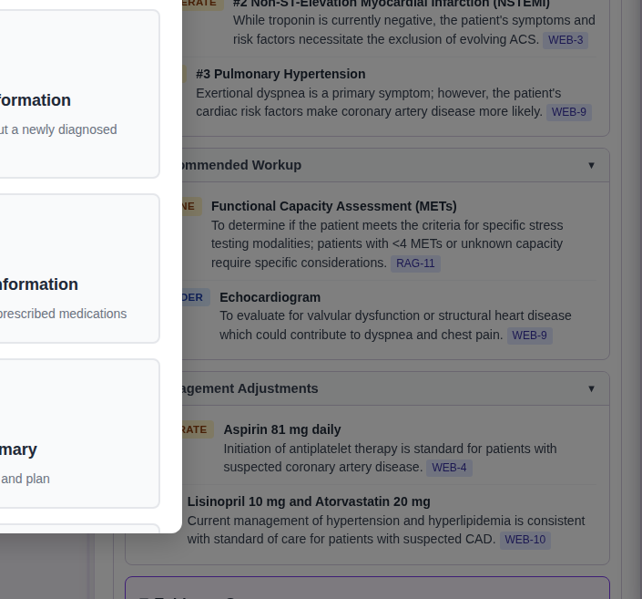

# Evidence-Based Consult Comments

After generating a note, you can request an **evidence-backed consult comment** — additional clinical commentary supported by current medical literature, guidelines, and safety checks.

---

## How It Works

1. **Generate your note first** — the comment is based on the note content.
2. Click the **"Evidence Based Comments"** button below the note.
3. The system runs multiple checks in parallel:
   - Searches medical literature for relevant evidence
   - Checks for medication safety issues and drug interactions
   - Identifies red flags and clinical concerns
   - Scores findings by severity and confidence
4. The comment appears in a separate card below your note with references listed.

---

## What You Get

- **Clinical commentary** relevant to your specific case
- **Severity scoring** — findings are ranked by clinical importance (High/Medium/Low)
- **Confidence levels** — how strongly the evidence supports each finding
- **References** to supporting literature and guidelines
- **Medication safety alerts** — potential drug interactions or dosing concerns
- **Red flag detection** — warning signs that may need urgent attention

---

## Using the Comment

- Copy the comment into your chart as supplementary information
- Review the references to verify the evidence
- Use the comment to support your clinical reasoning — it does not replace your judgment
- Your **original note is unchanged** — the comment is a separate addition

---

## If It Doesn't Work

Click **"Retry Evidence Comment"** if the first attempt doesn't produce useful results.

---

**Related:** [Generating Your Note](../daily-workflow/generating.md) | [Medical Q&A](qa.md)
