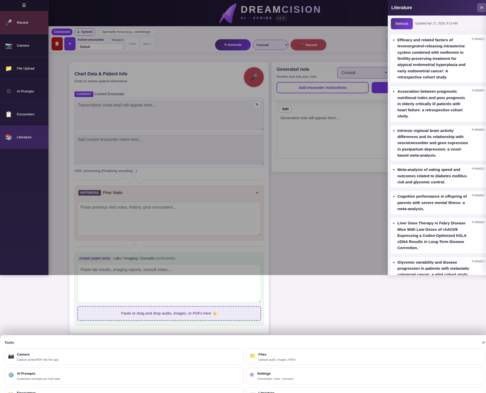

# Literature Updates

DreamCision automatically fetches and summarizes new medical literature every week, so you stay current without having to search for it yourself.

---

## Opening the Literature Panel

Click **Literature** (📖) in the left sidebar:

---

## What You See

The panel shows a list of recent updates:

- **Title** of the guideline, study, or update
- **Summary** of the key findings or changes
- **Date** of the update
- **Source** information

---

## Refreshing

Click **Refresh** to pull the latest summaries if new content has been added since your last visit.

---

## How It Works

Behind the scenes, the system:

1. Fetches new clinical guidelines and research on a weekly schedule
2. Processes and summarizes the content
3. Makes it available in the Literature panel

You do not need to configure anything — it just works.

---

**Next:** [Mobile Guide](../mobile/mobile.md)
