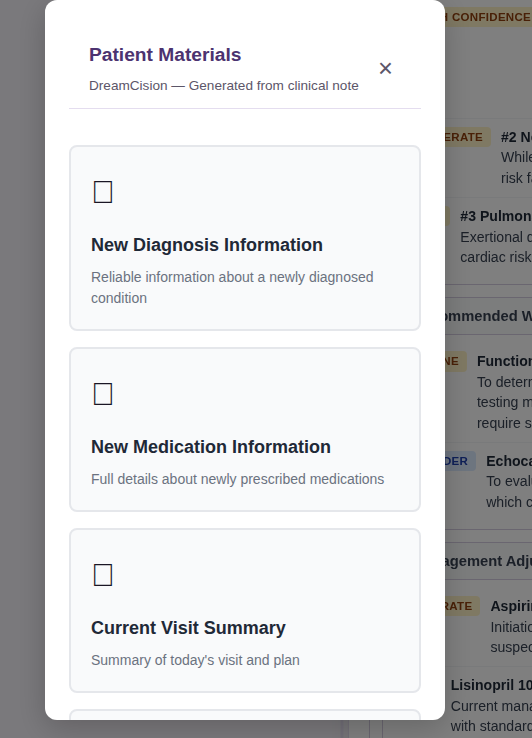

# Patient Materials

DreamCision can generate patient-facing educational materials based on the clinical encounter. These are written in plain language for patients to understand — not clinical jargon.

---

## What You Can Generate

The Patient Materials dialog offers six categories of patient-facing materials:

- **New Diagnosis Information** — Reliable information about a newly diagnosed condition
- **New Medication Information** — Full details about newly prescribed medications
- **Current Visit Summary** — Summary of today's visit and plan
- **Diet Plan** — Nutrition recommendations tailored to the patient's condition
- **Exercise Plan** — Physical activity guidance appropriate for the patient's status
- **Comprehensive Health Report** — Comprehensive overview of your overall health and care

---

## How to Generate Patient Materials

1. **Generate your clinical note first** — patient materials are based on the encounter data and note content.
2. Click the **"Patient Materials"** button in the Generated Note panel.
3. **Select one or more categories** from the dialog (each has a checkbox).
4. The system generates the selected materials in plain language.
5. Review the output, edit if needed, and copy or print it for the patient.

---

## What Makes Patient Materials Different

- **Plain language:** Written at a reading level most patients can understand
- **Actionable:** Focuses on what the patient should do, not clinical reasoning
- **Safe:** Includes appropriate disclaimers and encourages follow-up
- **Encounter-specific:** Tailored to the patient's current condition, not generic advice

---

## Using Patient Materials

- **Print for the patient:** Hand them the material at the end of the visit
- **Copy to the chart:** Include it as part of the documentation
- **Edit as needed:** Customize the material to match your specific recommendations
- **Combine types:** Generate multiple types (e.g., diet plan + medication guide) for comprehensive patient education

---

## Limitations

- Patient materials are **educational supplements**, not a substitute for direct patient counseling
- Always review the generated material before giving it to the patient
- The system may not account for all patient-specific factors (allergies, cultural preferences, etc.)
- For complex cases, consider supplementing with printed materials from professional organizations

---

**Related:** [Generating Your Note](../daily-workflow/generating.md) | [Reviewing & Editing](../daily-workflow/reviewing.md)
