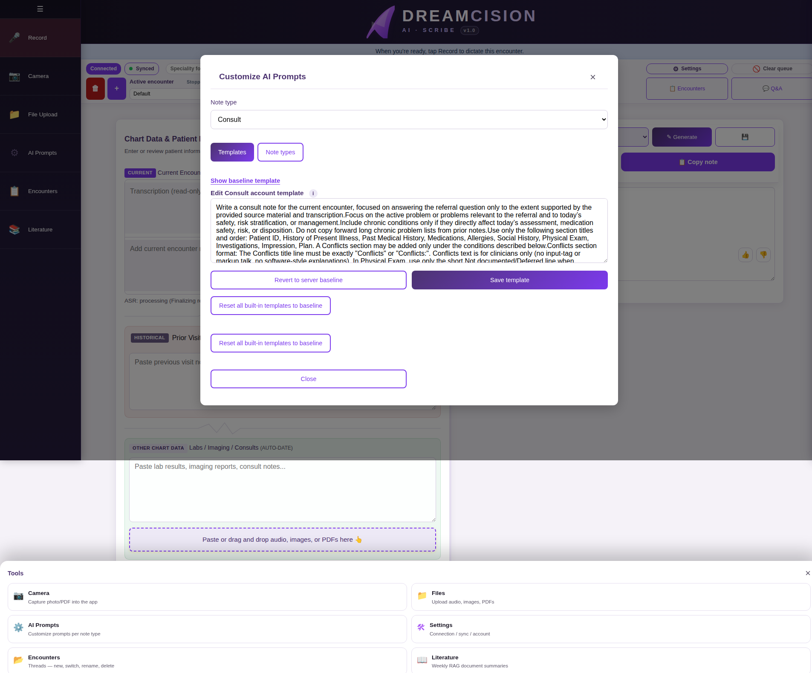
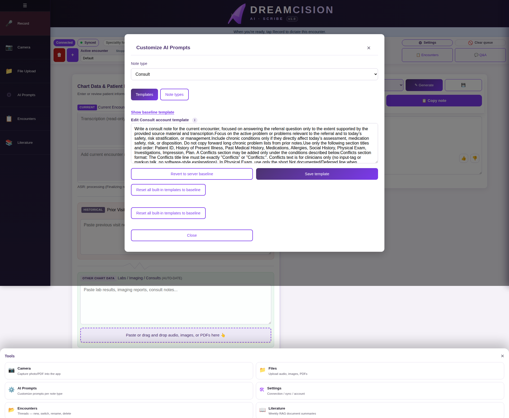
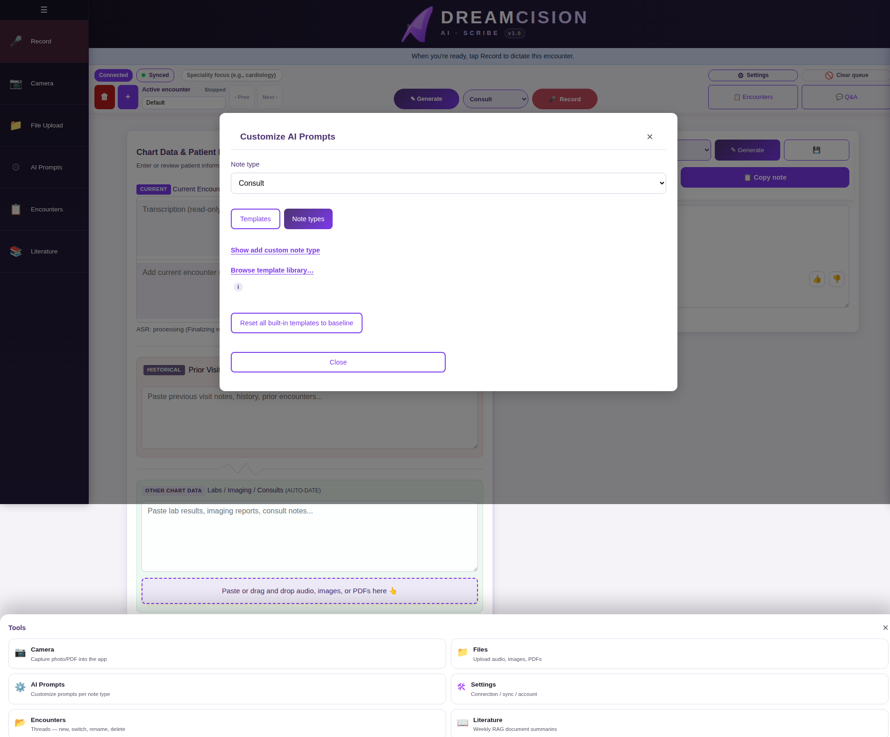

# Customizing AI Prompts

A **prompt** is the set of instructions the AI follows when generating your note. DreamCision comes with well-crafted default prompts for each note type, but you can customize them to match your personal style and preferences.

---

## Opening the Prompt Settings

Click **AI Prompts** (⚙️) in the left sidebar:

---

## The Templates Tab

The **Templates** tab lets you view and edit the prompt template for each note type:

### Viewing the Baseline

Click **"Show baseline template"** to see the original default prompt. This is read-only and shows what the AI was given before any customization.

### Editing Your Template

The main text area shows your current template for the selected note type. You can:

- Add instructions ("Always include a differential diagnosis")
- Remove sections you don't need
- Change the tone or style
- Add specific formatting preferences

### Saving Changes

Click **"Save template"** to save your changes. They apply the next time you generate a note of that type.

### Reverting

- **"Revert to server baseline"** — Restores the default template for the current note type
- **"Reset all built-in templates to baseline"** — Restores defaults for all note types (does not affect custom types)

---

## The Note Types Tab

The **Note Types** tab manages your note type list:

Here you can:

- See all available note types (built-in and custom)
- Rename custom note types
- Delete custom note types
- Add new custom note types

---

## Tips for Customizing Prompts

- **Start small** — make one change at a time and test the result
- **Be specific** — "Include medication doses in mg" is better than "be more detailed"
- **Keep it clinical** — the AI works best with clear, direct instructions
- **Use the baseline as reference** — the default templates are well-tested; build on them rather than starting from scratch

---

**Next:** [Custom Note Types](custom-types.md)
