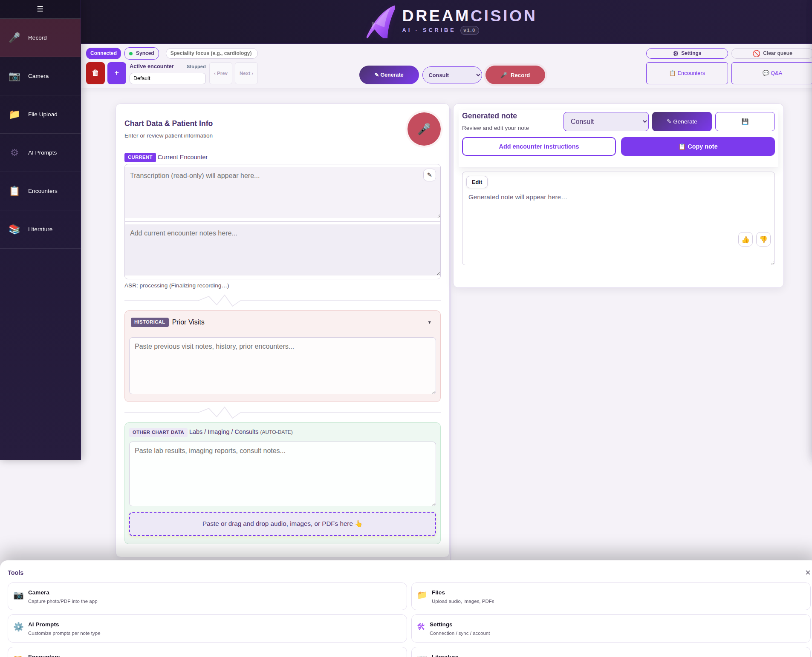

# Medical Q&A

The built-in Medical Q&A lets you ask clinical questions and get evidence-backed answers — all within DreamCision.

---

## Opening Q&A

Click the **Q&A** button (💬) in the top bar:

The Q&A panel opens on the right side of your workspace.

---

## Asking a Question

1. Type your clinical question in the text area
2. Press **Send** (or press Enter)
3. The answer streams in real time

### Example Questions

- "What are first-line treatments for uncomplicated hypertension?"
- "What is the dose of enoxaparin for DVT prophylaxis?"
- "Differential diagnosis for acute onset hemoptysis in a smoker?"

---

## Attaching Images (Vision Q&A)

You can attach images to your questions — for example, a lab result or an ECG:

1. Click the attachment icon in the Q&A composer
2. Select an image file
3. Ask your question referencing the image

The AI can see and interpret the image in context.

---

## Follow-Up Questions

You can ask follow-up questions in the same conversation. The AI remembers the context of your previous questions and answers.

---

## Starting a New Topic

Click **"New topic"** to start a fresh conversation. This clears the context so previous questions don't influence the new one.

---

## Evidence Citations

When available, answers include an **Evidence** line showing how many sources (RAG and/or web) were used to generate the response.

---

## Tips

- Be specific in your questions for better answers
- Include relevant patient details (age, sex, key findings) when asking about a specific case
- Always verify answers against your own knowledge and guidelines — Q&A is a decision support tool, not a replacement for clinical judgment

---

**Next:** [Literature Updates](literature.md)
