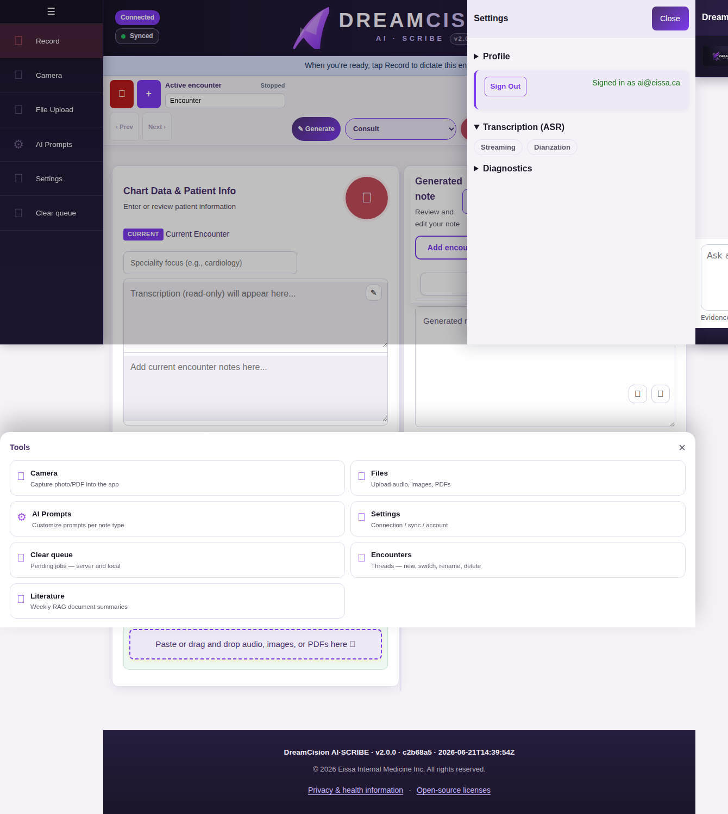

# ASR Settings

DreamCision uses Whisper for speech-to-text transcription. You can customize how audio is processed using two settings: **Streaming** and **Diarization**.

---

## Accessing ASR Settings

Click the **Settings** icon (⚙️) in the tools sidebar, then select the **ASR** tab.

---

## Streaming

**What it does:** When enabled, transcription results appear in real time as you speak, rather than waiting for the entire recording to finish.

- **Enabled:** You see text appear as you talk. Useful for long encounters where you want to verify accuracy mid-way.
- **Disabled:** Transcription runs after recording stops. Faster overall processing, but no live feedback.

**Default:** Enabled

---

## Diarization

**What it does:** Identifies different speakers in the recording and labels them (Speaker 1, Speaker 2, etc.).

- **Enabled:** The system separates patient speech from clinician speech. Adds processing time.
- **Disabled:** All speech is transcribed as a single stream. Faster, but no speaker separation.

**Default:** Enabled

**Learn more:** [ASR Diarization](asr-diarization.md)

---

## Saving Your Settings

Settings are saved automatically and apply to your next recording. They persist across sessions.

---

**Related:** [ASR Diarization](asr-diarization.md) | [Dictating a Note](voice-recording.md) | [Troubleshooting ASR Issues](../troubleshooting/asr-issues.md)
