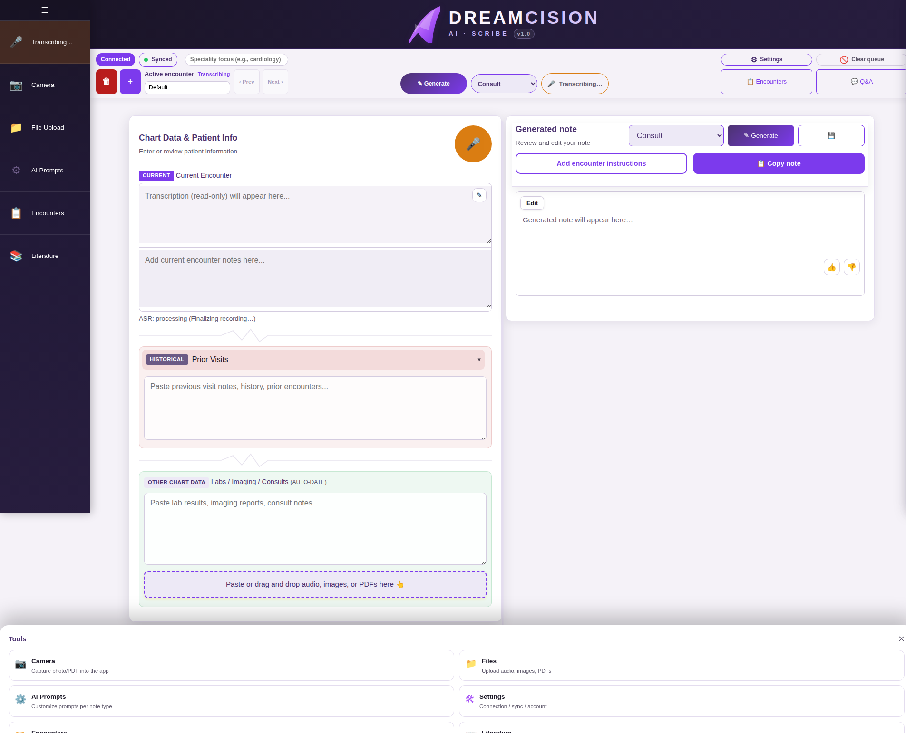
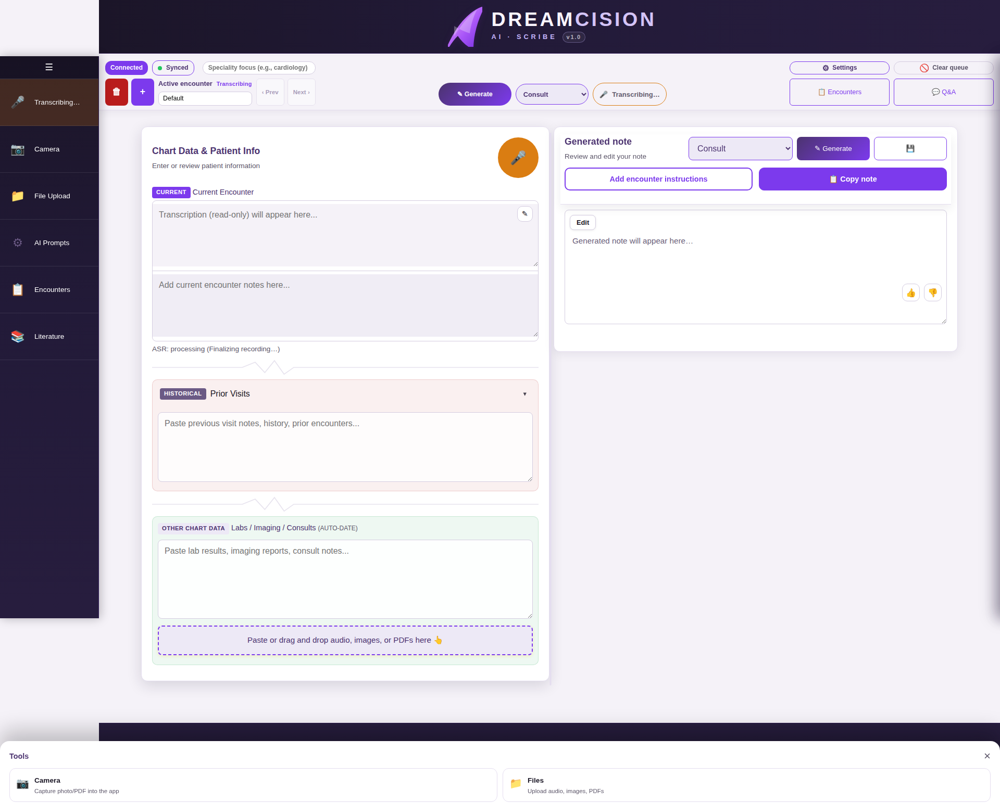

# Adding Chart Data

The **Chart Data & Patient Info** panel (left column) is where you organize all the information that will go into your clinical note.

---

## Current Encounter

This is the main input area. It has two parts:

### Transcription (Read-Only Display)
The top portion shows your voice transcription. This is read-only by default — click the ✎ edit icon to make changes.

### Encounter Notes (Editable)
The bottom portion is where you can type additional notes for the current encounter. Use this for:

- Quick observations you want to add
- Patient statements you want to record verbatim
- Any information not captured in the voice recording

---

## Prior Visits (Historical)

This collapsible section is for information from **previous encounters**. Click the header to expand or collapse it.

Use this area for:

- Previous visit notes
- Past medical history relevant to the current encounter
- Prior treatment plans or follow-up notes

**Why separate it?** The AI knows to treat this as background context rather than current findings, which helps generate more accurate notes.

---

## Labs / Imaging / Consults

Paste lab results, imaging reports, or consult notes in this section.

### Automatic Date Detection

The app automatically tries to detect dates in pasted content and classify items as current or historical. If a date cannot be determined, the item appears in an "Items Needing Date Verification" section with a warning icon so you can review it.

### What to Paste Here

- Laboratory results (copy from your lab system)
- Radiology/imaging reports
- Specialist consultation notes
- Any other objective data

---

## Drag and Drop

You can drag and drop files directly onto any field in the Chart Data panel:

- **Audio files** → processed as voice transcription
- **Images** → processed by OCR (text extraction)
- **PDFs** → processed by OCR (text extraction)

---

## Character Limits

Each text field has a character limit (50,000 characters). A counter appears when you approach the limit. If you exceed it, a warning message appears.

---

**Next:** [Uploading Documents](uploading.md)
