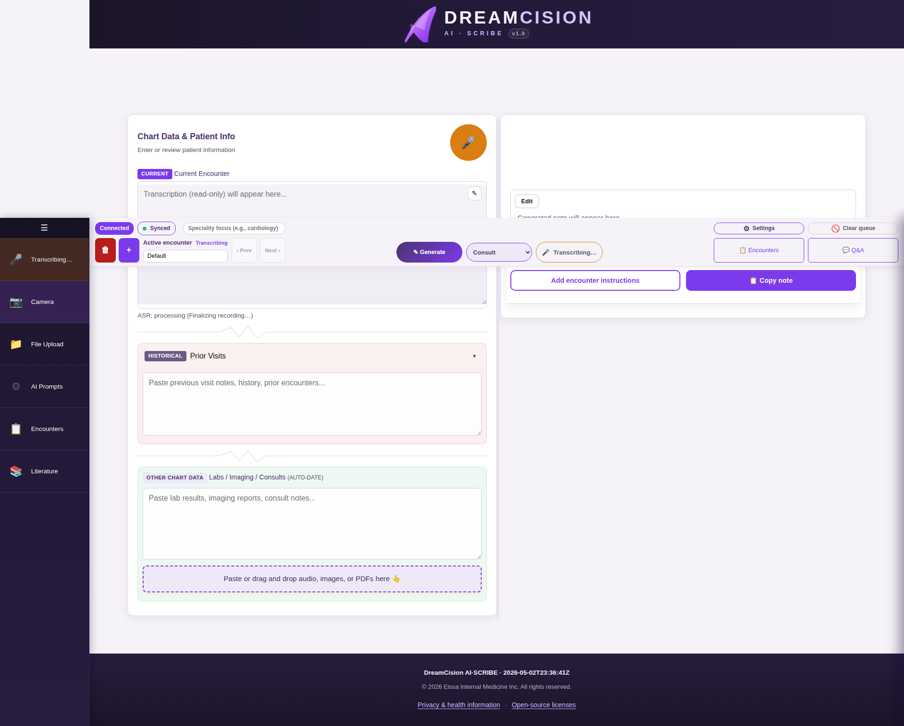
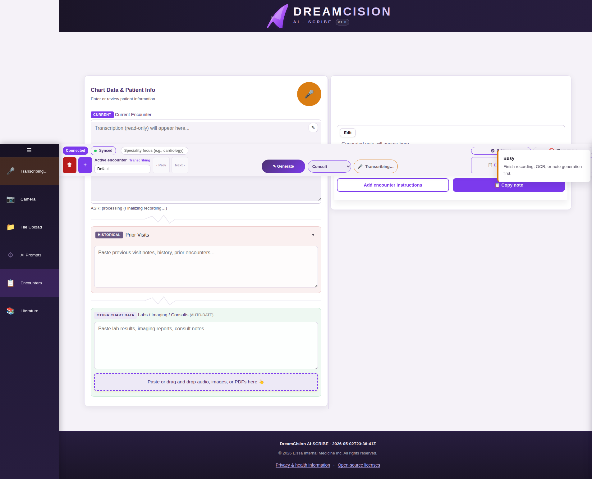

# Managing Encounters

An **encounter** is a single patient visit or clinical interaction. Each encounter has its own transcription, chart data, and generated notes — completely separate from other encounters.

Think of an encounter like a fresh page in your charting notebook.

---

## The Encounter Strip

The active encounter strip is in the top bar:

| Element | What It Does |
|---------|-------------|
| **Encounter name** | Click to rename your encounter |
| **+ button** | Create a new encounter |
| **🗑️ button** | Delete the current encounter |
| **Prev / Next** | Switch between encounters |
| **Recording status** | Shows if recording is active (Stopped / Recording) |

---

## Creating a New Encounter

### Quick Method
Click the **+** button in the encounter strip.

### Full Method
1. Click **Encounters** in the top bar or left sidebar
2. The Encounters panel opens
3. Click **+ New encounter**

---

## Naming Your Encounters

By default, encounters are unnamed. You should give them meaningful names for easy identification:

1. Click in the encounter name field
2. Type a name (e.g., "J. Smith — Chest Pain Follow-up")
3. Click away from the field — the name saves automatically

**Tip:** Use a consistent naming convention, like "LastName, FirstName — Reason for Visit"

---

## Switching Between Encounters

- Click **Prev** or **Next** in the encounter strip to move between encounters
- Or open the **Encounters** panel and click on any encounter to switch to it

Each encounter maintains its own data. Switching does not lose any work.

---

## Closing an Encounter

To close the current encounter (clear the workspace without deleting):

1. Click **Encounters** in the top bar
2. Click **Close encounter**

This clears the current view but keeps the encounter saved.

---

## Deleting an Encounter

⚠️ **This cannot be undone.**

Click the **🗑️** (trash) button in the encounter strip to delete the current encounter. All data for that encounter — transcription, notes, generated output — is permanently removed.

---

## Why Encounters Matter

- **Separation:** Each patient visit is isolated — no mixing of data
- **Organization:** Name your encounters for easy reference
- **Queue isolation:** The processing queue is scoped to the active encounter only
- **Privacy:** Closing or deleting an encounter removes patient data from the active workspace

---

**Next:** [Advanced Features — Customizing AI Prompts](../advanced/prompts.md)
