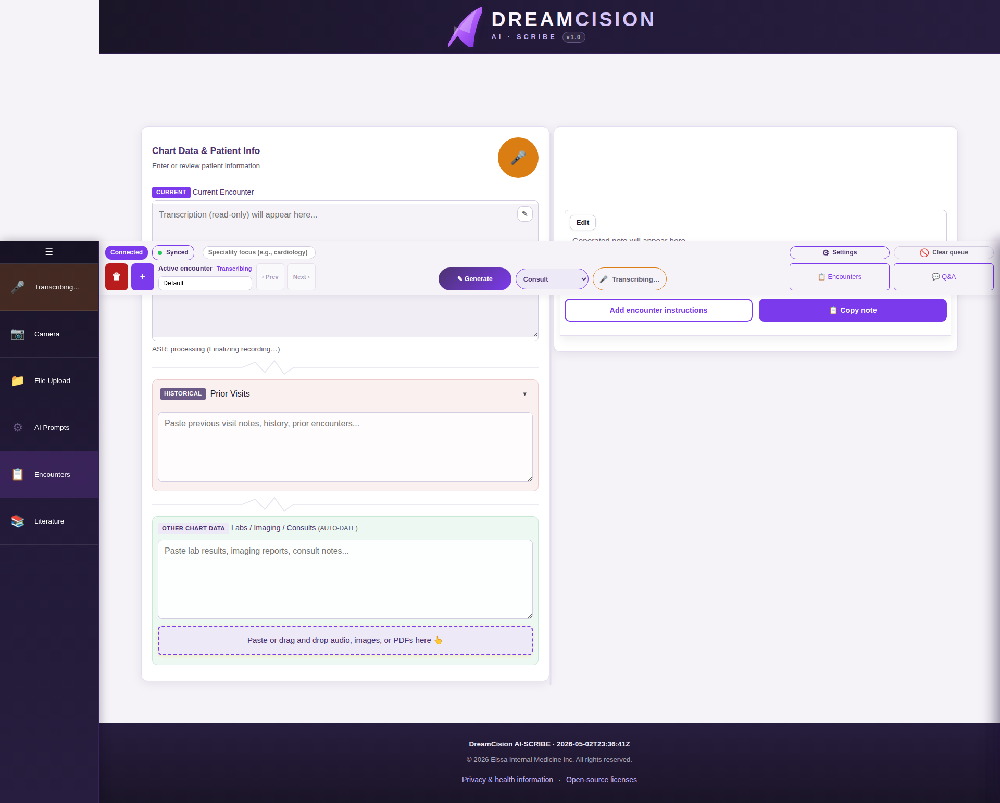

# Generating Your Note

Once you have your chart data ready, it's time to generate your clinical note.

---

## Step 1: Select a Note Type

Use the note type dropdown in the top bar (or the mirror dropdown in the Generated Note panel):

### Available Note Types

| Note Type | Best For |
|-----------|---------|
| **Consultation Note** | New patient consultations, specialist opinions |
| **Follow-up Note** | Return visits, monitoring ongoing conditions |
| **Referral Letter** | Referring patients to specialists |
| **Admission Note** | Hospital admissions |
| **Progress Note / SOAP** | Routine progress documentation |
| **Discharge Summary** | Summarizing hospital stays and discharge plans |
| **Transfer Note** | Transferring patients between facilities |
| **Procedure Note** | Documenting procedures performed |
| **Summarize** | Creating a summary of lengthy chart data |
| **Custom (Free Form)** | Any format not covered above |

---

## Step 2: Add Instructions (Optional)

Click **"Add encounter instructions"** above the note area to add special directions for this generation:

- "Focus on assessment and plan"
- "Be brief"
- "Include medication doses"
- "Emphasize the differential diagnosis"

These instructions are sent only with this generation request — they are not saved to your account.

---

## Step 3: Press Generate

Click the **Generate** button (✓ Generate) in the top bar or the note panel:

---

## Step 4: Wait for Generation

The note streams in real time. You will see a "Generating..." indicator:

- Generation typically takes 10-60 seconds depending on the amount of data
- You can see the note appear word by word
- If you need to stop, click the **Stop** button

---

## Step 5: Note Appears

Your generated note appears in the right column, formatted and ready to review:

---

## What the AI Uses

The AI generates your note based on:

1. **Your chart data** — transcription, typed notes, uploaded documents
2. **Your note type** — determines the structure and format
3. **Your profile** — your name, specialty, and location are included
4. **Your template** — if you have customized the prompt template for this note type
5. **Your encounter instructions** — if you added any

---

## Generation Failed?

If generation fails or produces poor results:

1. Check your **connection status** (should say "Connected")
2. Make sure you have **chart data** entered (the AI needs something to work with)
3. Try again — sometimes a second attempt produces better results
4. Check the **Encounter Queue** for any failed processing items

---

**Next:** [Reviewing & Editing Your Note](reviewing.md)
