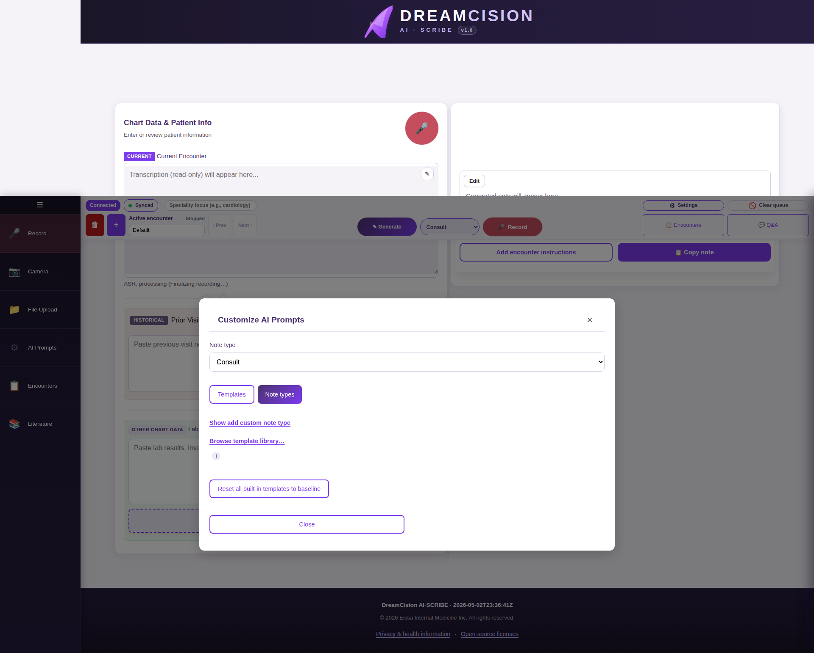
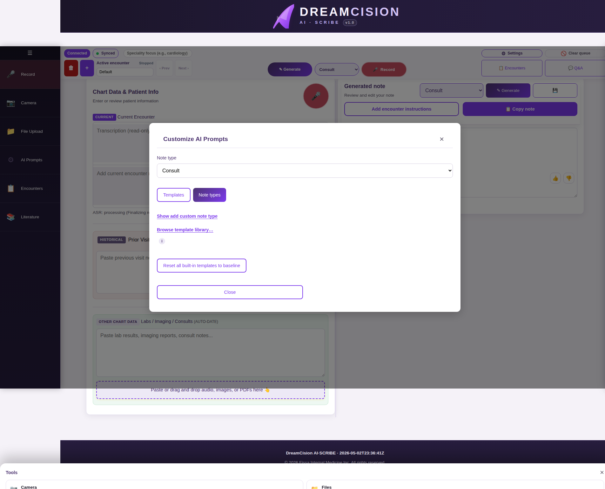
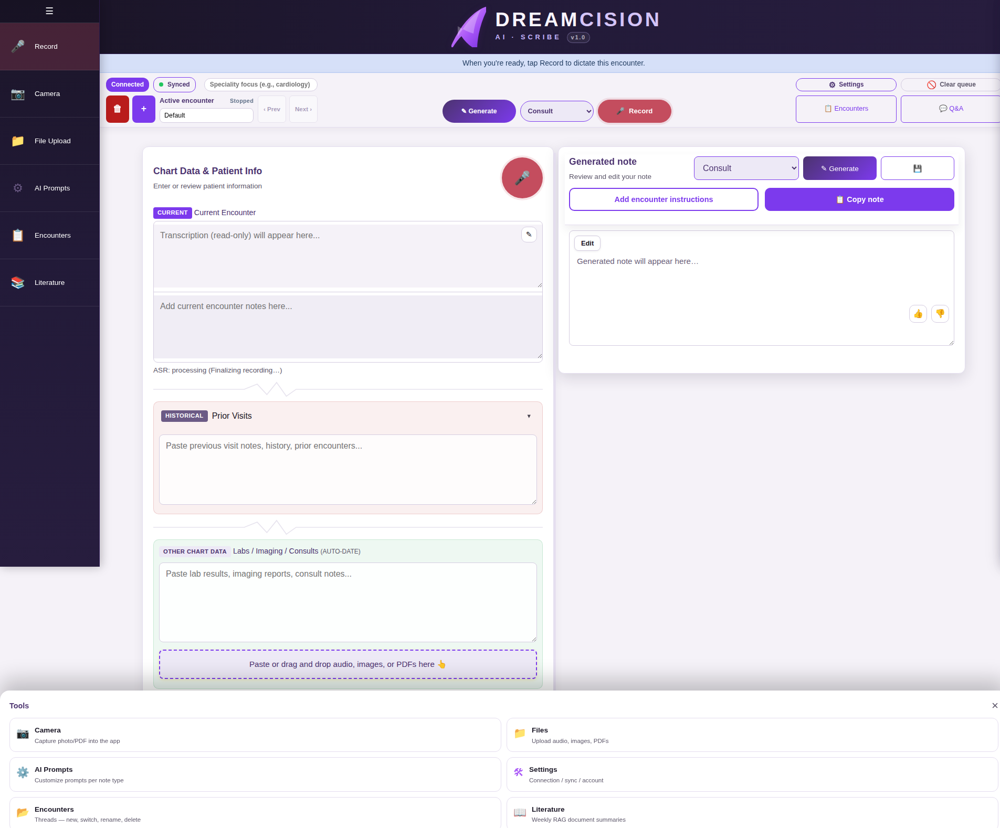

# Reviewing & Editing Your Note

After the AI generates your note, review it carefully. **You are responsible for the final content — always verify before using.**

---

## Reading the Note

The generated note appears in formatted view by default. Headings, lists, and paragraphs are rendered cleanly:

---

## Editing the Note

Click the **Edit** button to switch to edit mode:

### Formatting Toolbar

While editing, use the toolbar to add formatting:

| Button | What It Does |
|--------|-------------|
| **B** | Bold selected text |
| *I* | Italicize selected text |
| **H2** | Insert a heading |
| **• List** | Create a bullet list |
| **1.** | Create a numbered list |
| **—** | Insert a horizontal divider |

### Editing Tips

- Highlight text, then click a formatting button
- Type freely — the editor accepts any text
- The formatting uses simple markdown (standard text markers)
- Click **Edit** again to return to preview mode and see how it looks

---

## Copying Your Note

The **Copy Note** button is the most important button in the app:

### What Happens When You Click Copy

| Destination | What You Get |
|------------|-------------|
| **Microsoft Word** | Rich formatted text (headings, bold, lists preserved) |
| **EMR text field** | Clean plain text (markdown markers removed) |
| **Notepad** | Plain text |

The app automatically detects the destination and formats accordingly. Just click Copy Note, then paste (Ctrl+V / Cmd+V) into your destination.

---

## Saving / Downloading

Click the **Save** button (💾) in the note panel header to download your note as a file.

---

## Rating the Output

After generating a note, you can provide feedback:

| Button | Meaning |
|--------|---------|
| 👍 | Good — the note met your needs |
| 👎 | Needs work — click to suggest what should be improved |

Your feedback helps improve the system over time.

---

## Additional Features After Generation

### Evidence-Based Consult Comments

After generating a note, you may see an **"Evidence Based Comments"** button. Click it to get additional commentary backed by medical literature:

This generates a separate comment with references — your original note remains unchanged.

### Order & Referral Requests

If the AI detected orders or referral requests in your note, an **"Order & Referral Requests"** button appears:

Click it to review, edit, and copy individual requests.

---

**Next:** [Managing Encounters](encounters.md)
