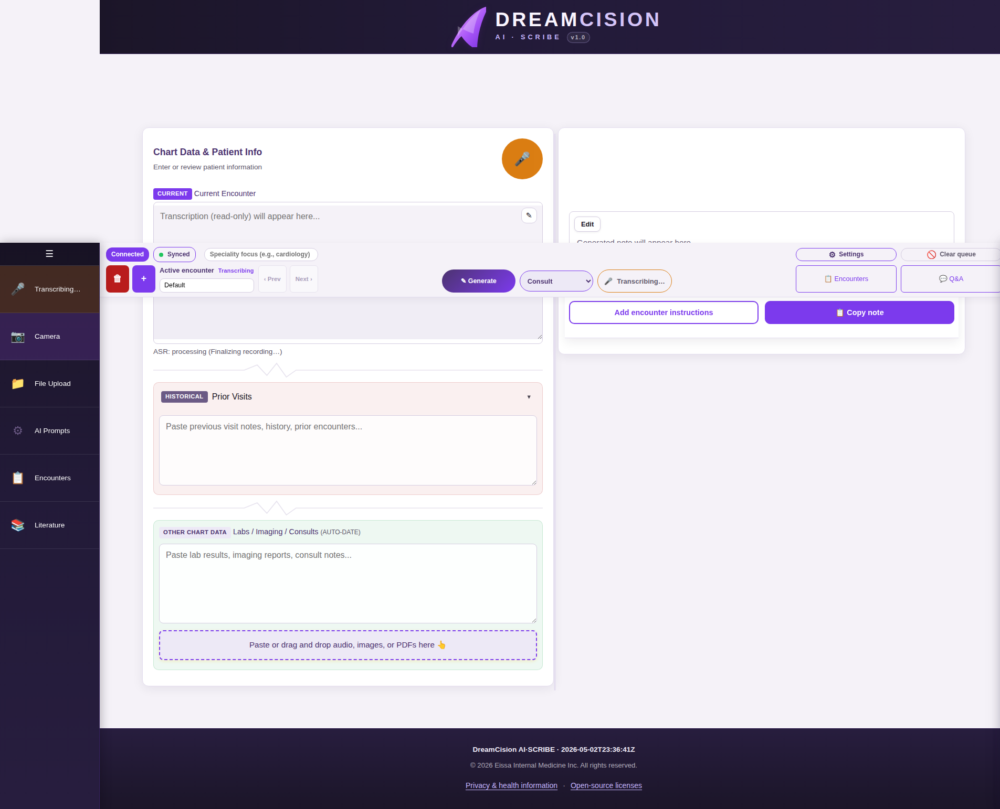
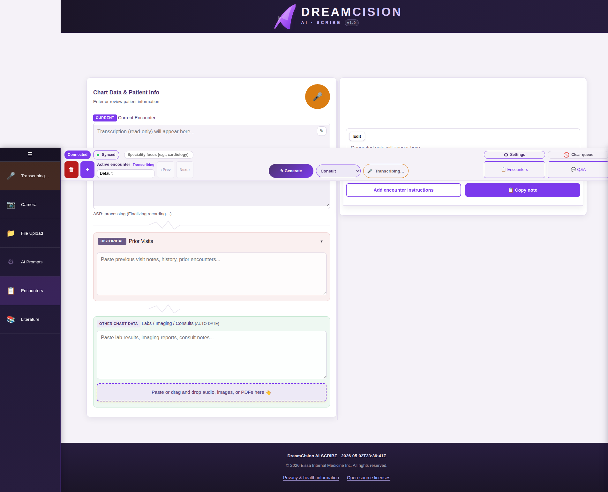

# Uploading Documents

You can get information into DreamCision in three ways: camera capture, file upload, and drag-and-drop.

---

## Camera Capture

Use the camera to quickly photograph lab results, prescriptions, or handwritten notes.

### On Desktop

1. Click the **Camera** icon (📷) in the left sidebar
2. The camera modal opens with a live preview
3. Position your document in frame
4. Click **Capture Photo**

### On Mobile

On mobile, tap **Tools** in the bottom navigation, then tap **Camera**. The phone's camera opens directly.

---

## File Upload

Use file upload for audio recordings, images, or PDFs already on your device.

1. Click the **File Upload** icon (📂) in the left sidebar
2. Select one or more files from your device
3. The files are automatically processed

### Supported File Types

| Type | What Happens |
|------|-------------|
| **Audio** (mp3, wav, m4a, etc.) | Transcribed using speech recognition |
| **Images** (jpg, png, gif, webp, heic) | Text extracted using OCR |
| **PDFs** | Text extracted using OCR |

---

## Drag and Drop

The fastest method: drag files from your computer and drop them anywhere in the Chart Data panel.

The drop zone shows a visual hint when you drag files over it.

---

## Processing Queue

When you upload files, they enter a processing queue. You can see the status of each item in the **Encounter Queue** card:

| Action | What It Does |
|--------|-------------|
| **Retry All** | Re-process all items in the queue |
| **Retry** (per row) | Re-process a single item |
| **Download** (per row) | Download the processed result |
| **Delete** (per row) | Remove an item from the queue |
| **Clear encounter queue** | Remove all items |

---

## What Happens After Upload

- **Audio files** → Transcription appears in the Current Encounter section
- **Images/PDFs** → Extracted text appears in the Labs/Imaging/Consults section
- Processing takes a few seconds to a minute depending on file size

---

**Next:** [Generating Your Note](generating.md)
