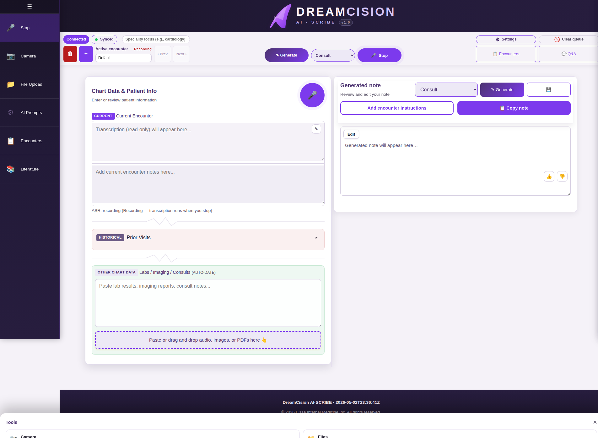

# Dictating a Note (Voice Recording)

Voice recording is the fastest way to capture your clinical encounter. Just speak naturally — the app transcribes everything in real time.

---

## Step 1: Start Recording

Click the **Record** button. You can find it in two places:

- **Top bar:** The microphone button labeled "Record"
- **Left sidebar:** The 🎙️ icon at the top

You can also find a round record button in the Chart Data panel header.

---

## Step 2: Consent Audio Plays

On the first Record press for each encounter, the app automatically plays a brief audio message:

> *"Recording with patient permission."*

This is your reminder to ensure the patient knows you are recording.

---

## Step 3: Speak Naturally

While recording, the button changes appearance to indicate it is active.

**Speak naturally.** You do not need to use special commands or formal language. Talk as you normally would during a patient encounter. The transcription will appear in the **Current Encounter** section of the Chart Data panel.

### Tips for Better Transcription

- Speak clearly at a normal pace
- Minimize background noise when possible
- Medical terminology is handled well — use your normal clinical language
- If you make a verbal mistake, just correct yourself naturally ("no, I meant 150 milligrams")

---

## Step 4: Stop Recording

Click the **Record** button again to stop. Your full transcription appears in the Current Encounter section:

---

## Streaming and Diarization

### Streaming (Real-Time Transcription)

By default, DreamCision transcribes your speech in real time. You will see text appear in the Chart Data panel while you're still recording, giving you immediate feedback that the system is capturing your words.

You can disable streaming in [ASR Settings](asr-settings.md#streaming) if you prefer to wait until the recording is complete.

### Speaker Diarization

If diarization is enabled, the system will identify different speakers and label them (e.g., "Speaker 1", "Speaker 2"). This helps separate clinician observations from patient statements.

Learn more: [ASR Diarization](asr-diarization.md)

---

## Editing the Transcription

After recording, you can edit the transcription text directly. Click the **edit icon** (✎) next to the transcription to make corrections.

You can also type additional notes below the transcription in the same text area.

---

## Re-Transcribing

If you want to re-process the full encounter recording (for example, if the first transcription had too many errors), click the **Re-transcribe** button that appears below the transcription area. This replaces the existing transcription with a fresh one.

---

## Multiple Recordings

You can record multiple times in the same encounter. Each new recording appends to the existing transcription. This is useful if you have breaks in the encounter or want to capture different sections separately.

---

## Recording on Mobile

On mobile, tap the **Record** button from the top bar or the Tools sheet. The experience is the same — speak, stop, and the transcription appears.

---

## Troubleshooting Recording

| Problem | Solution |
|---------|---------|
| Microphone permission denied | Check your browser's site settings and allow microphone access |
| No audio being captured | Check that your microphone is connected and not muted |
| Transcription is garbled | Speak more slowly, reduce background noise, or re-transcribe |
| Recording button is greyed out | Check that your connection status says "Connected" |

---

**Next:** [Adding Chart Data](chart-data.md)
