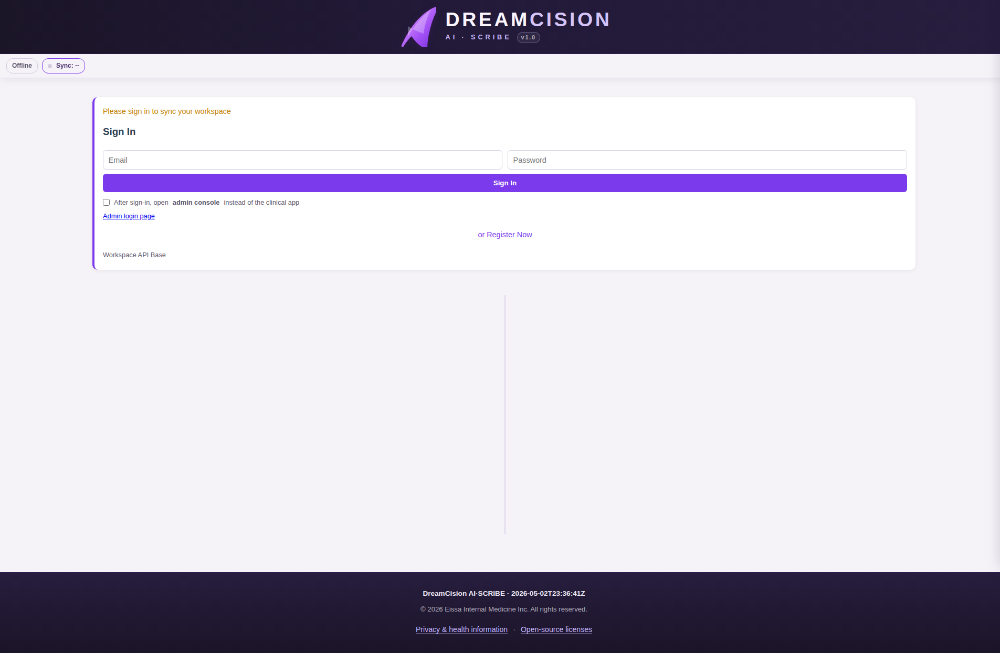

# Creating Your Account

DreamCision uses a registration-and-approval system. You create your own account, and an administrator approves it before you can sign in.

---

## Step 1: Go to DreamCision

Open your browser and navigate to:

**[dreamcision.com](https://dreamcision.com)** or **[notes.ieissa.com](https://notes.ieissa.com)**

You will see the sign-in screen:

---

## Step 2: Register

At the bottom of the sign-in form, click **"or Register Now"**:

The registration form appears. Fill in:

| Field | What to Enter |
|-------|--------------|
| **Email** | Your professional email address |
| **Password** | A strong password (you choose) |

Click **Register**.

---

## Step 3: Wait for Approval

After registering, you will see a message that your account is pending approval.

**You cannot sign in yet.** An administrator needs to approve your account first. This typically happens quickly — you will be notified when your account is ready.

---

## Step 4: Sign In

Once your account is approved, return to the sign-in screen and enter your email and password. Click **Sign In**.

You will be taken to your workspace.

---

### Can't Sign In?

| Problem | Solution |
|---------|---------|
| "Account pending approval" | Wait for admin approval — try again later |
| "Invalid credentials" | Check your email and password for typos |
| Forgot password | Contact your administrator |

---

**Next:** [Signing In](signing-in.md)
