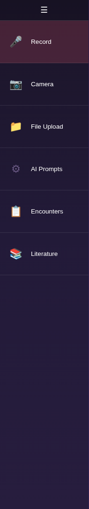
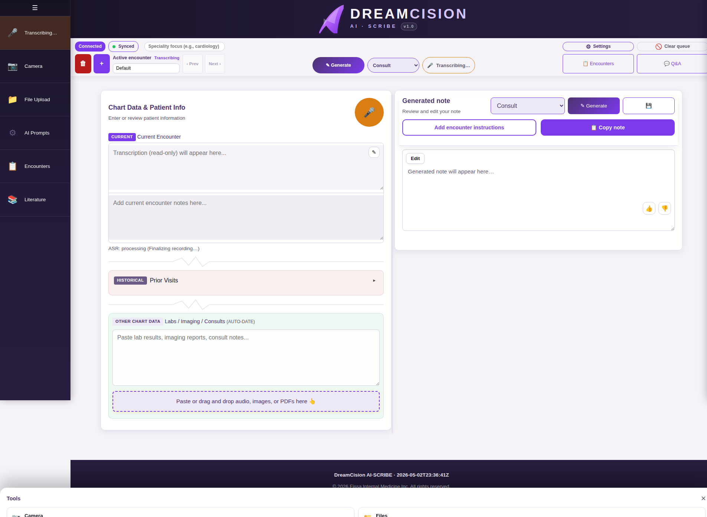
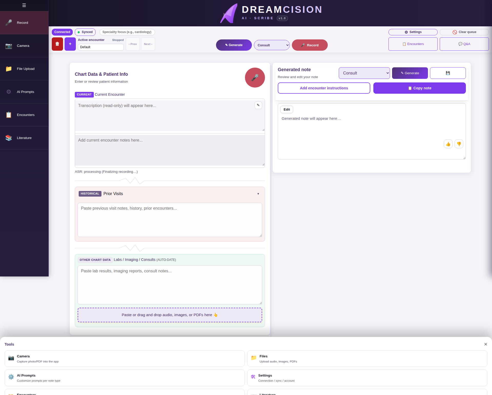
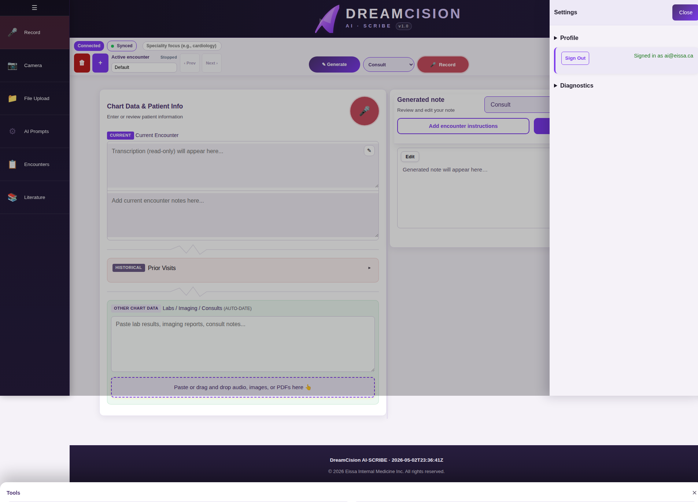

# Your First Time — Workspace Tour

This is your DreamCision workspace. Let's walk through each area.

---

## 1. Top Bar

The floating bar at the top of the screen:

| Element | What It Does |
|---------|-------------|
| **Connection Status** | Shows if you are Connected or Disconnected to the server |
| **Sync Status** | Shows workspace sync state |
| **Specialty Field** | Optional — type your specialty focus (e.g., "Cardiology") to help the AI tailor notes |
| **Active Encounter Strip** | Shows your current encounter name, with buttons to create new encounters, switch between them, or delete |
| **Generate Button** | Generates your clinical note from the chart data |
| **Note Type Dropdown** | Select the type of note (Consultation, Follow-up, Discharge, etc.) |
| **Record Button** | Start/stop voice recording |
| **Settings** | Opens settings (profile, connection, diagnostics) |
| **Clear Queue** | Clears all pending items in the processing queue |
| **Encounters** | Opens the encounters management panel |
| **Q&A** | Opens the Medical Q&A panel |

---

## 2. Left Sidebar (Tools)

The narrow toolbar on the left side:

| Icon | Tool | What It Does |
|------|------|-------------|
| 🎙️ | **Record** | Start voice recording (same as top bar Record button) |
| 📷 | **Camera** | Capture a photo (lab result, prescription, etc.) |
| 📂 | **File Upload** | Upload audio, images, or PDF files |
| ⚙️ | **AI Prompts** | Customize how the AI generates notes |
| 📋 | **Encounters** | Manage your encounters (threads) |
| 📖 | **Literature** | View weekly medical literature summaries |

---

## 3. Chart Data Panel (Left Column)

This is where you put your raw clinical information:

### Current Encounter
Your active transcription (from voice recording) and typed notes for the current patient visit. This is the primary input for note generation.

### Prior Visits (Historical)
Expandable section for previous encounter notes, history, or past visits. Collapsed by default to save space.

### Labs / Imaging / Consults
Paste lab results, imaging reports, or consult notes here. The app automatically detects dates and organizes the data.

### Drag-and-Drop Area
Drop audio files, images, or PDFs anywhere in the Chart Data panel and they will be processed automatically.

---

## 4. Generated Note Panel (Right Column)

This is where your clinical note appears:

| Element | What It Does |
|---------|-------------|
| **Note Type selector** | Change note type (mirrors the top bar dropdown) |
| **Generate button** | Creates the note from your chart data |
| **Save/Download button** | Downloads the note as a file |
| **Copy Note button** | Copies formatted text (works in Word and EMR systems) |
| **Add encounter instructions** | Optional — add special instructions for this generation |
| **Note preview** | Read the generated note in formatted view |
| **Edit button** | Switch to edit mode to modify the note |
| **Formatting toolbar** | Bold, italic, headings, lists when editing |
| **Feedback buttons** | 👍 Good / 👎 Needs work — rate the output |

---

## 5. Setting Up Your Profile

Before your first encounter, set up your profile:

1. Click **Settings** in the top bar
2. Expand the **Profile** section
3. Fill in:
   - **Display name** — How you want to appear in notes
   - **Default specialty** — e.g., "Internal Medicine"
   - **Default location** — e.g., "Yarmouth, NS"
4. Click **Save profile**

This information is automatically included in your generated notes.

---

## You're Ready!

Now that you know the layout, move on to the **Daily Workflow** section to learn how to dictate, generate, and copy your first clinical note.

**Next:** [Daily Workflow Overview](../daily-workflow/overview.md)
