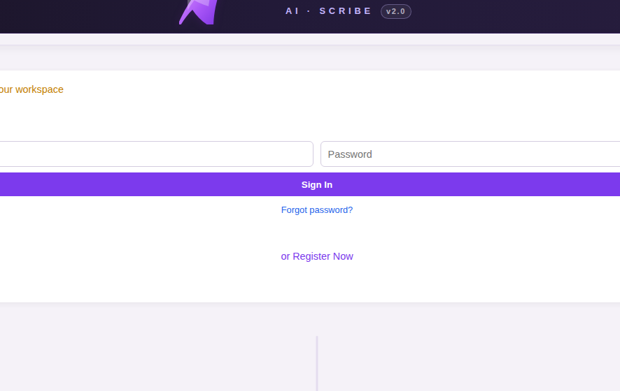

# Password Recovery

If you forget your password, you can reset it yourself — no need to contact the admin.

---

## Step 1: Click "Forgot Password?"

On the sign-in screen, click the **"Forgot Password?"** link below the password field.

---

## Step 2: Enter Your Email

Type the email address associated with your DreamCision account and click **Send Reset Link**.

---

## Step 3: Check Your Email

You will receive an email from `noreply@support.dreamcision.com` with a password reset link. The link expires after **1 hour** for security.

**Check your spam/junk folder** if you don't see it within a few minutes.

---

## Step 4: Set a New Password

Click the link in the email, enter your new password, and confirm it. Your password must be at least **8 characters** long.

---

## Step 5: Sign In

Return to the sign-in screen and log in with your new password.

---

## If You Don't Receive the Email

- Check your spam/junk folder
- Make sure you entered the correct email address
- Wait a minute and try again
- If it still doesn't arrive, contact your system administrator

---

**Related:** [Signing In](signing-in.md)
