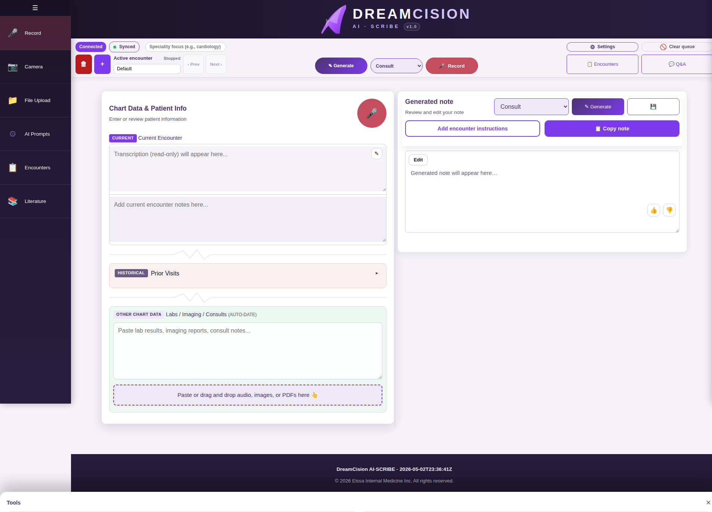

# Signing In

## The Sign-In Screen

When you open DreamCision, you see the sign-in screen:

Enter your **email** and **password**, then click **Sign In**.

---

## Forgot Your Password?

Click the **"Forgot Password?"** link on the sign-in screen to reset your password via email. See [Password Recovery](password-recovery.md) for details.

---

## After Signing In

Once authenticated, you are taken to your workspace — the main clinical documentation screen. You will see:

- Your **connection status** (should say "Connected")
- The **Chart Data** panel on the left
- The **Generated Note** panel on the right
- The **tools sidebar** on the far left

---

## Staying Signed In

- Your session stays active as long as the browser tab is open
- Closing the browser or refreshing the page may require you to sign in again
- Always sign out when finished on shared computers using the **Sign Out** button

---

## Going Directly to Admin Console

There is an option at the bottom of the login form to open the admin console after sign-in. This is for administrators only — regular users should not use this.

---

**Next:** [Your First Time — Workspace Tour](first-time.md)
