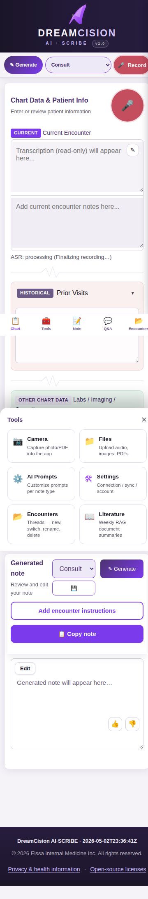
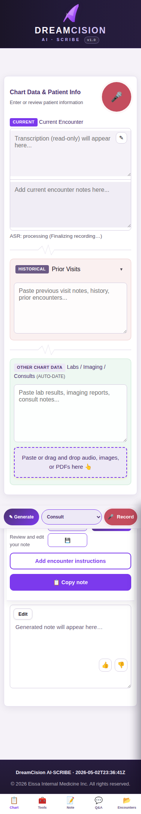

# Using DreamCision on Mobile

DreamCision works on phones and tablets. The core features are the same — record, generate, copy — but the layout is optimized for smaller screens.

---

## Mobile Layout

On mobile, the workspace stacks vertically instead of side by side. The Chart Data panel appears first, followed by the Generated Note panel below.

---

## Bottom Navigation

The bottom navigation bar gives you quick access to the main areas:

| Tab | What It Does |
|-----|-------------|
| 📋 **Chart** | Scroll to the Chart Data panel |
| 🛠️ **Tools** | Opens the Tools sheet (see below) |
| 📝 **Note** | Scroll to the Generated Note panel |
| 💬 **Q&A** | Open the Medical Q&A panel |
| 📂 **Encounters** | Open the Encounters panel |

---

## Tools Sheet

Tap **Tools** to open the Tools sheet:

| Tool | What It Does |
|------|-------------|
| 📷 **Camera** | Capture a photo into the app |
| 📁 **Files** | Upload audio, images, PDFs |
| ⚙️ **AI Prompts** | Customize prompts per note type |
| 🔧 **Settings** | Connection, sync, account settings |
| 📂 **Encounters** | Manage encounters |
| 📖 **Literature** | Weekly document summaries |

---

## Recording on Mobile

Voice recording works the same on mobile:

1. Tap the **Record** button (in the top bar or Tools sheet)
2. Speak
3. Tap **Record** again to stop
4. Transcription appears in the Current Encounter section

---

## Key Differences from Desktop

| Feature | Desktop | Mobile |
|---------|---------|--------|
| Layout | Side by side columns | Stacked vertically |
| Tools | Left sidebar | Bottom nav + Tools sheet |
| Text entry | Keyboard | On-screen keyboard |
| File upload | Drag and drop | File picker |
| Camera | Modal dialog | Native camera |

---

## Tips for Mobile Use

- Use headphones with a microphone for cleaner recordings
- Landscape mode gives more horizontal space for reading notes
- The **Copy Note** button works the same — copy to any app
- Make sure your browser has microphone permission enabled

---

**Next:** [Troubleshooting](../troubleshooting/troubleshooting.md)
