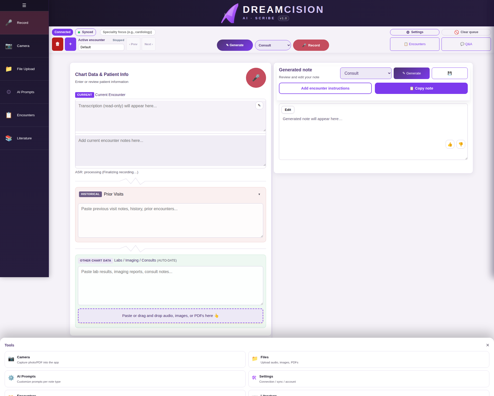

# Troubleshooting

---

## I Can't Sign In

| Symptom | Solution |
|---------|---------|
| "Account pending approval" | Your account has not been approved yet. Wait for the administrator to approve your registration. |
| "Invalid credentials" | Double-check your email and password. Passwords are case-sensitive. |
| Page won't load | Check that you are using the correct URL: [dreamcision.com](https://dreamcision.com) or [notes.ieissa.com](https://notes.ieissa.com) |
| Forgot password | Click **"Forgot password?"** on the sign-in screen for a self-service reset. See [Password Recovery](../getting-started/password-recovery.md). |

---

## Recording Is Not Working

| Symptom | Solution |
|---------|---------|
| Browser asks for microphone permission | Click **Allow** when the browser prompts you |
| Microphone permission already denied | Click the lock icon in your browser's address bar → Site settings → Enable Microphone |
| No audio captured | Check that your microphone is connected and not muted in your system settings |
| Record button is greyed out | Check that your connection status says "Connected" (top bar, left side) |

---

## Transcription Is Wrong or Garbled

| Symptom | Solution |
|---------|---------|
| Words are misspelled | Click the ✎ edit icon and correct the transcription manually |
| Whole sections are wrong | Click the **Re-transcribe** button to re-process the recording |
| Medical terms are wrong | Speak more clearly and slowly for technical terms, or type corrections |
| Background noise in transcription | Try recording in a quieter environment |

---

## Note Generation Is Slow

Generation time depends on:

- **Amount of data** — more chart data takes longer to process
- **Note type** — some types generate longer notes
- **Server load** — if others are using the system simultaneously

**Normal range:** 10-60 seconds. If generation takes longer than 2 minutes, check your connection status and try again.

---

## Note Generation Failed

| Symptom | Solution |
|---------|---------|
| Error message appears | Check the error details, then try again |
| Nothing happens | Check that you have chart data entered — the AI needs input to work with |
| "Disconnected" status | Your connection to the server was lost. Wait a moment and try again. |

---

## I Can't Upload Files

| Symptom | Solution |
|---------|---------|
| File type not accepted | Supported types: audio (mp3, wav, m4a), images (jpg, png, pdf), PDFs |
| File too large | Try compressing the file or splitting it into smaller pieces |
| Upload fails | Check your internet connection and try again |

---

## The Encounter Queue Has Failed Items

1. Open the **Encounter Queue** card
2. Click **Retry** on individual items, or **Retry All** for everything
3. If items continue to fail, check the file format and size

---

## Connection Status Shows "Disconnected"

This means your browser has lost connection to the server.

- Wait a moment — it may reconnect automatically
- Refresh the page
- Check that the server is running (contact your administrator if the problem persists)

---

## The App Looks Different on My Phone

This is normal. DreamCision has a mobile-optimized layout with:

- Stacked panels instead of side-by-side
- Bottom navigation bar
- Tools sheet instead of sidebar

All features work the same — the layout is just rearranged for smaller screens.

---

## Clearing the Queue

If you have a lot of items stuck in the processing queue:

1. Click **Clear Queue** in the top bar (clears all items)
2. Or click **Clear encounter queue** in the Encounter Queue card (clears only the current encounter)

---

## Still Having Problems?

If none of the above helps, contact your system administrator with:

- A description of what is happening
- A screenshot of any error messages
- Your browser name and version
- Whether it happens on desktop, phone, or both
